# mHealth Agent Architecture Overview

**Source baseline:** `docs/AI_AGENT_DESIGN.md`  
**Current code reviewed:** `app/api/agents/*`, `lib/agents/*`, `lib/masshealth/*`, `lib/benefit-orchestration/*`  
**Status:** Current implementation overview

## Executive Summary

The current mHealth agent architecture has moved beyond the earlier "current state" described in `AI_AGENT_DESIGN.md`. The app now has separated specialist agent routes under `app/api/agents/`, an AI SDK streaming/ReAct pattern for conversational agents, persistent benefit-advisor memory, and reflection quality gates for appeal letters and eligibility explanations.

The canonical runtime pattern is:

1. Request validation and authentication in a Next.js route.
2. Language and domain context resolution.
3. `streamText()` with typed AI SDK tools for agentic reasoning.
4. Deterministic engines for eligibility and benefit scoring.
5. RAG tools for MassHealth policy grounding.
6. Data annotations (`data-masshealth`) for structured UI updates.
7. Reflection quality gates before user-facing appeal letters and eligibility explanations are committed.

Legacy endpoints still exist for compatibility, especially `app/api/chat/masshealth/route.ts`, `app/api/appeals/analyze/route.ts`, and `app/api/appeals/extract-document/route.ts`. New work should prefer the separated `app/api/agents/*` routes unless a specific legacy client requires otherwise.

## System-Level Architecture

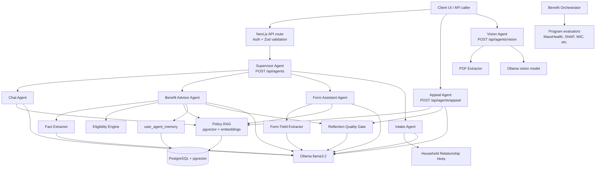

## Shared Design Principles

- Deterministic rules own eligibility decisions, FPL math, program scoring, and application bundle ranking.
- LLMs own extraction, conversation, drafting, summarization, and reflection.
- RAG is used for policy-grounded explanations, appeal support, document requirements, and general MassHealth Q&A.
- Streaming agents use AI SDK `streamText()` with typed tools and bounded `stepCountIs(...)` loops.
- Structured client state is sent through `data-masshealth` annotations.
- Failure behavior is intentionally soft for RAG, extraction, memory, and reflection where possible.

---

## 1. Supervisor Agent

**Purpose:** Classify a general user message and route it to the correct specialist agent when the client does not know which route to call.

**Primary files:**

- `app/api/agents/route.ts`

**Architecture design:**

- API boundary: `POST /api/agents`.
- Input contract: `{ messages, language? }`.
- Uses `generateText()` with `Output.object()` and a strict Zod enum schema.
- Allowed intents: `benefit_advisor`, `form_assistant`, `intake`, `general`.
- Dynamically imports the selected specialist route and forwards the original request body and headers.
- Appeal and vision are intentionally excluded because they need structured denial/document inputs.
- Fallback behavior: classification failure routes to `general`.

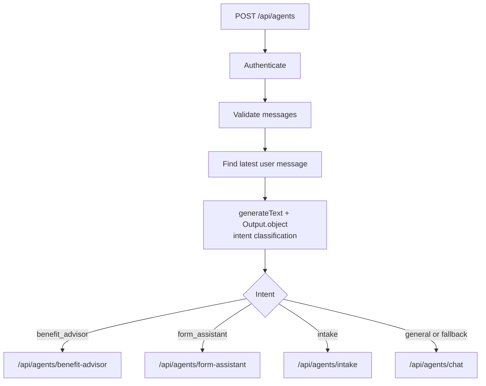

---

## 2. Chat Agent

**Purpose:** Answer general MassHealth questions with policy-grounded, plain-language guidance without performing eligibility screening or form extraction.

**Primary files:**

- `app/api/agents/chat/route.ts`
- `lib/agents/chat/tools.ts`
- `lib/agents/chat/prompts.ts`

**Architecture design:**

- API boundary: `POST /api/agents/chat`.
- Input contract: `{ messages, language? }`.
- Has an out-of-scope guard before LLM invocation.
- Uses `streamText()` with a bounded 3-step ReAct loop.
- Tool surface: `retrieve_policy`.
- RAG query is supplied by the model and capped by tool schema limits.
- Emits a `data-masshealth` annotation for scope/status.
- Failure behavior: RAG returns empty context; route-level stream errors return a generic failure message.

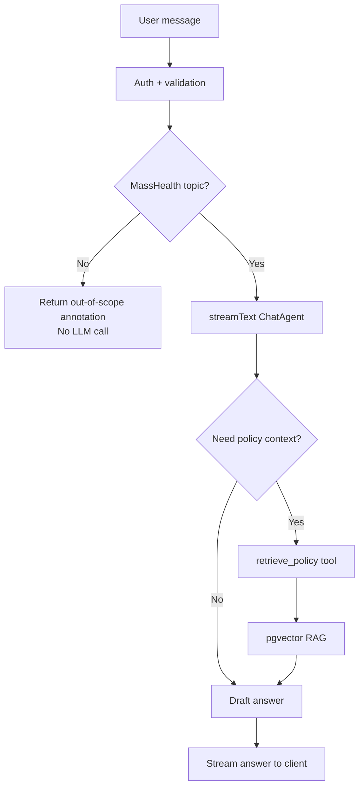

---

## 3. Benefit Advisor Agent

**Purpose:** Help users understand likely MassHealth eligibility by combining extracted user facts, persisted memory, deterministic eligibility rules, RAG policy grounding, and a reflection-reviewed final explanation.

**Primary files:**

- `app/api/agents/benefit-advisor/route.ts`
- `lib/agents/benefit-advisor/tools.ts`
- `lib/agents/benefit-advisor/prompts.ts`
- `lib/agents/memory/*`
- `lib/eligibility-engine.ts`
- `lib/agents/reflection/quality-gate.ts`

**Architecture design:**

- API boundary: `POST /api/agents/benefit-advisor`.
- Input contract: `{ messages, language? }`.
- Loads `user_agent_memory` before prompting.
- Uses `streamText()` with a bounded 5-step ReAct loop.
- Tool sequence expected by prompt:
  - `extract_eligibility_facts`
  - `check_eligibility`
  - `retrieve_policy`
  - `finish_eligibility_explanation`
- The LLM controls tool calls, but deterministic eligibility remains in TypeScript.
- Extracted facts are merged with known memory facts before sufficiency checks.
- Extracted facts are saved asynchronously to memory.
- `check_eligibility` emits structured eligibility results to the UI.
- Final prose must pass the reflection gate before being committed as `eligibilityExplanation`.

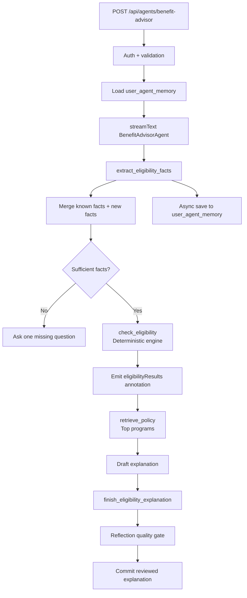

**Deterministic boundary:** `runEligibilityCheck()` owns FPL and program eligibility; the model may explain results but should not invent thresholds.

**Retrieval strategy:** Query from top program names and relevant eligibility topics, not the full transcript.

**Evaluation metrics:** eligibility agreement against fixtures, fact extraction accuracy, memory reuse rate, reflection revision rate, and P95 latency.

---

## 4. Form Assistant Agent

**Purpose:** Help users complete MassHealth application sections by extracting form fields, updating structured UI state, and answering section-specific policy questions.

**Primary files:**

- `app/api/agents/form-assistant/route.ts`
- `lib/agents/form-assistant/tools.ts`
- `lib/agents/form-assistant/prompts.ts`
- `lib/masshealth/form-field-extraction.ts`

**Architecture design:**

- API boundary: `POST /api/agents/form-assistant`.
- Input contract includes messages, language, current section, current fields, existing household members, and existing income sources.
- Uses `streamText()` with a bounded 4-step ReAct loop.
- Tool surface:
  - `extract_form_fields`
  - `retrieve_policy`
- `extract_form_fields` captures route context by closure so the model does not pass raw app state.
- Extracted fields are emitted as `data-masshealth` annotations for immediate UI updates.
- RAG is optional and only used for policy or document guidance.
- Sensitive field boundary: SSN is explicitly excluded from LLM extraction.

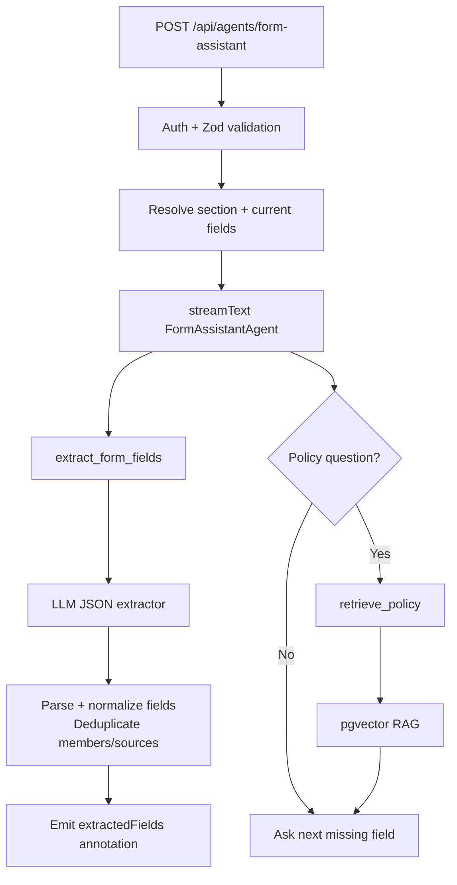

---

## 5. Intake Agent

**Purpose:** Run a one-question-at-a-time intake interview for MassHealth applications while avoiding redundant household relationship questions.

**Primary files:**

- `app/api/agents/intake/route.ts`
- `lib/agents/intake/tools.ts`
- `lib/agents/intake/prompts.ts`
- `lib/masshealth/household-relationships.ts`

**Architecture design:**

- API boundary: `POST /api/agents/intake`.
- Input contract: `{ messages, language?, applicationType? }`.
- Uses `streamText()` with a bounded 3-step ReAct loop.
- Tool surface: `extract_household_hints`.
- Relationship extraction is regex/pattern based, not an LLM call.
- Emits a minimal in-scope annotation before streaming.
- Prompt enforces one question at a time.

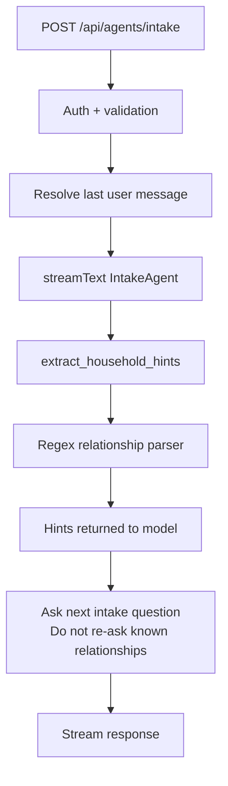

---

## 6. Fact Extractor

**Purpose:** Convert conversation text into structured eligibility facts for the Benefit Advisor and deterministic eligibility engine.

**Primary files:**

- `lib/masshealth/fact-extraction.ts`

**Architecture design:**

- Not a public API route; invoked as a Benefit Advisor tool dependency.
- Uses Ollama `llama3.2` via direct HTTP request.
- Prompt is extractor-only and JSON-only.
- Parses only explicitly stated facts.
- Omits unknown fields rather than outputting `null`.
- Converts common user statements into normalized `Partial<ScreenerData>`.
- Failure behavior: returns `{}`.

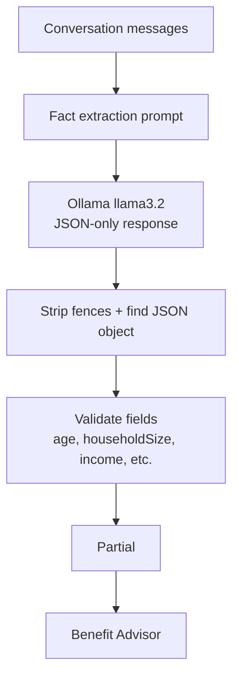

**Evaluation metrics:** JSON parse success, field precision/recall, monthly-to-annual conversion accuracy, and false default rate.

---

## 7. Form Field Extractor

**Purpose:** Convert application conversation into structured form fields that can update the ACA-3 application UI.

**Primary files:**

- `lib/masshealth/form-field-extraction.ts`

**Architecture design:**

- Not a public API route; invoked through the Form Assistant tool.
- Uses an extractor-only prompt and bounded message window.
- Excludes SSN and certification fields from LLM extraction.
- Parses applicant demographics, address, citizenship, household members, income sources, and explicit no-household/no-income flags.
- Normalizes date, phone, email, state, ZIP, income frequency, and duplicate household/income entries.
- Failure behavior: returns empty fields and `extractionFailed: true`.

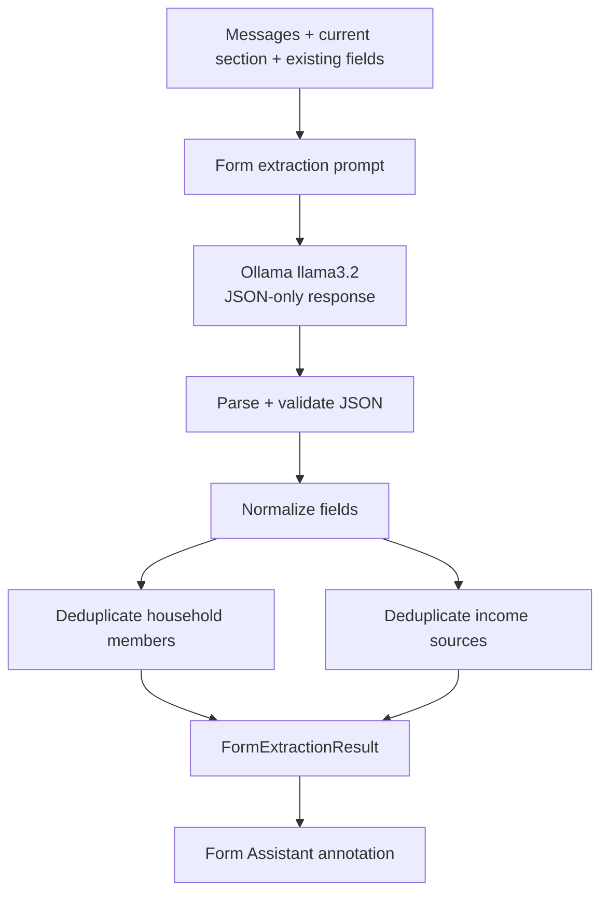

**Evaluation metrics:** extraction parse success, no-PII leakage into forbidden fields, duplicate suppression rate, and section-specific field accuracy.

---

## 8. Appeal Agent

**Purpose:** Generate a MassHealth appeal package: plain-language explanation, formal appeal letter, and evidence checklist grounded in retrieved policy and reviewed before delivery.

**Primary files:**

- `app/api/agents/appeal/route.ts`
- `lib/agents/appeal/tools.ts`
- `lib/agents/appeal/prompts.ts`
- `lib/agents/reflection/quality-gate.ts`
- Legacy: `app/api/appeals/analyze/route.ts`
- External draft proxy: `app/api/masshealth/appeals/draft/route.ts`

**Architecture design:**

- Canonical API boundary: `POST /api/agents/appeal`.
- Input contract: denial reason ID, denial details, optional document text, language.
- Uses `streamText()` with a bounded 3-step ReAct loop.
- Tool surface:
  - `retrieve_policy`
  - `finish_appeal`
- `retrieve_policy` stores policy context for later reflection.
- `finish_appeal` runs the reflection quality gate before emitting the structured appeal analysis.
- The route streams a brief next-step summary after the reviewed letter is committed.
- Legacy `/api/appeals/analyze` and `/api/masshealth/appeals/draft` also run the reflection gate before returning appeal letters.

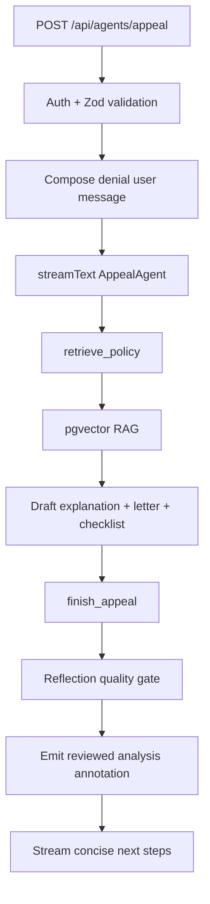

**Retrieval strategy:** Query from denial reason and appeal procedure terms. Uploaded denial text is included as task context, not as a retrieval query by default.

**Evaluation metrics:** letter completeness, specific evidence coverage, citation support rate, reflection revision rate, and malformed structured-output rate.

---

## 9. Vision Agent

**Purpose:** Extract readable text from denial letters and supporting documents so the Appeal Agent can use exact notice language, dates, case numbers, and appeal instructions.

**Primary files:**

- `app/api/agents/vision/route.ts`
- `lib/pdf/extract-pdf-json.ts`
- Legacy: `app/api/appeals/extract-document/route.ts`

**Architecture design:**

- API boundary: `POST /api/agents/vision`.
- Input contract: multipart form upload with `file`.
- Validates missing file, file size, and supported MIME/extension.
- PDF path uses local PDF extraction for metadata, page text, and form fields.
- Image path uses Ollama vision model (`llava`/configured model) with low temperature.
- Output is extracted text only; it is intended to be passed to the Appeal Agent as `documentText`.
- Failure behavior: extractor failures degrade to empty extracted text where possible; route-level exceptions return a typed error.

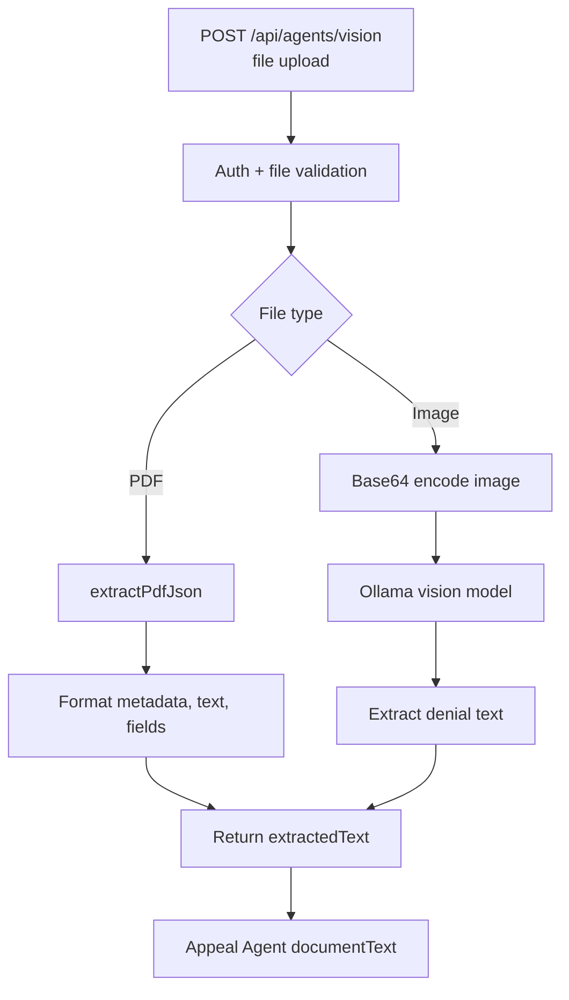

**Evaluation metrics:** extracted text completeness, denial reason/date/case-number capture rate, OCR timeout rate, and upload rejection correctness.

---

## 10. Eligibility Engine

**Purpose:** Deterministically evaluate MassHealth eligibility from normalized screener facts. This is not an LLM agent, but it is a core decision engine in the agent architecture.

**Primary files:**

- `lib/eligibility-engine.ts`

**Architecture design:**

- Function boundary: `runEligibilityCheck(ScreenerData)`.
- Computes annual FPL, monthly FPL, and income as percent of FPL.
- Applies MassHealth program logic for residency, immigration status, pregnancy, children, adults, disability, Medicare, employer insurance, and ConnectorCare alternatives.
- Returns structured `EligibilityReport` with program results, summary, status, actions, and display metadata.
- Called by Benefit Advisor through the `check_eligibility` tool.
- No model dependency.

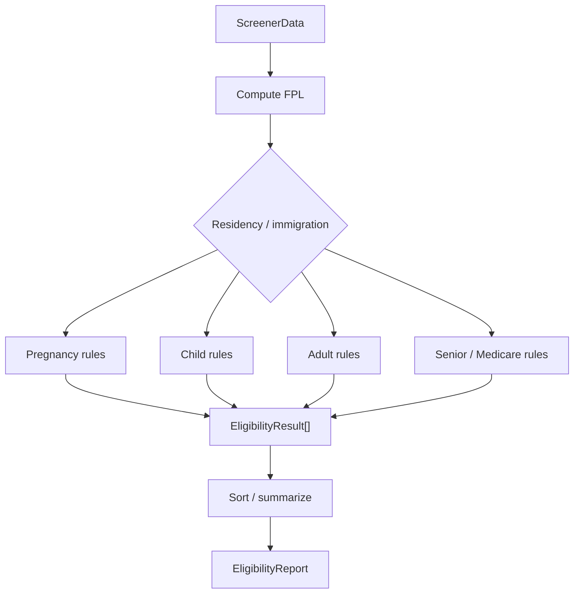

**Evaluation metrics:** fixture agreement, threshold edge cases, FPL calculation accuracy, and stable result ordering.

---

## 11. Benefit Orchestrator

**Purpose:** Evaluate a household profile across multiple Massachusetts safety-net programs and produce a ranked benefit stack with application bundles and estimated value.

**Primary files:**

- `lib/benefit-orchestration/orchestrator.ts`
- `lib/benefit-orchestration/programs/*`
- `app/api/benefit-orchestration/evaluate/route.ts`
- `app/api/benefit-orchestration/profile/route.ts`

**Architecture design:**

- Function boundary: `evaluateBenefitStack(rawProfile)`.
- Computes derived household fields, income, FPL, and program-specific eligibility.
- Runs multiple deterministic evaluators: MassHealth, MSP, SNAP, EITC, Section 8, childcare, LIHEAP, WIC, TAFDC, and EAEDC.
- Scores results by confidence, estimated value, urgency, and ease of application.
- Builds bundles for shared applications such as DTA, MassHealth/MSP, and pregnancy support.
- No model dependency.

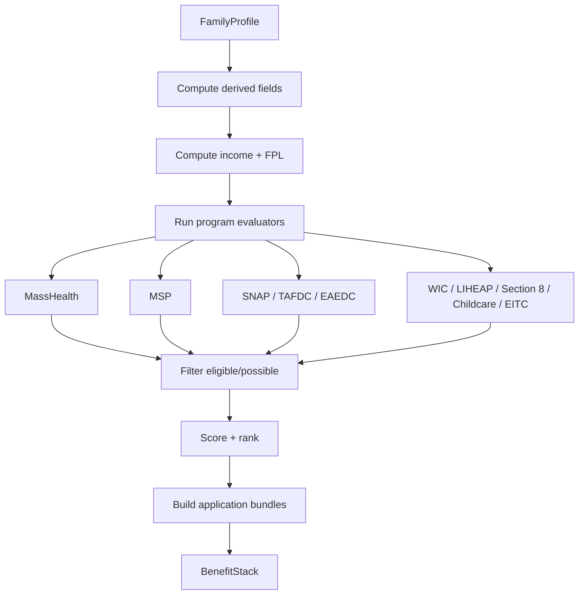

**Evaluation metrics:** program evaluator fixture coverage, bundle correctness, estimated value sanity checks, and ranking stability.

---

## 12. Reflection Quality Gate

**Purpose:** Self-review user-facing appeal letters and eligibility explanations for factual accuracy, layperson clarity, and specific evidence before they reach users.

**Primary files:**

- `lib/agents/reflection/quality-gate.ts`

**Architecture design:**

- Not public-facing; used by Appeal Agent, legacy appeal routes, appeal draft proxy, and Benefit Advisor.
- Uses `generateText()` with `Output.object()` and Zod schemas.
- Appeal schema returns `factuallyAccurate`, `clearToLayperson`, `hasSpecificEvidence`, `issues`, and optional `revisedLetter`.
- Eligibility schema returns the same quality booleans plus optional `revisedExplanation`.
- The quality gate uses task context:
  - Appeal: policy context, explanation, evidence checklist, draft letter.
  - Eligibility: deterministic eligibility context, policy context, draft explanation, language.
- Failure behavior: fail open with original text and `reviewed: false`.

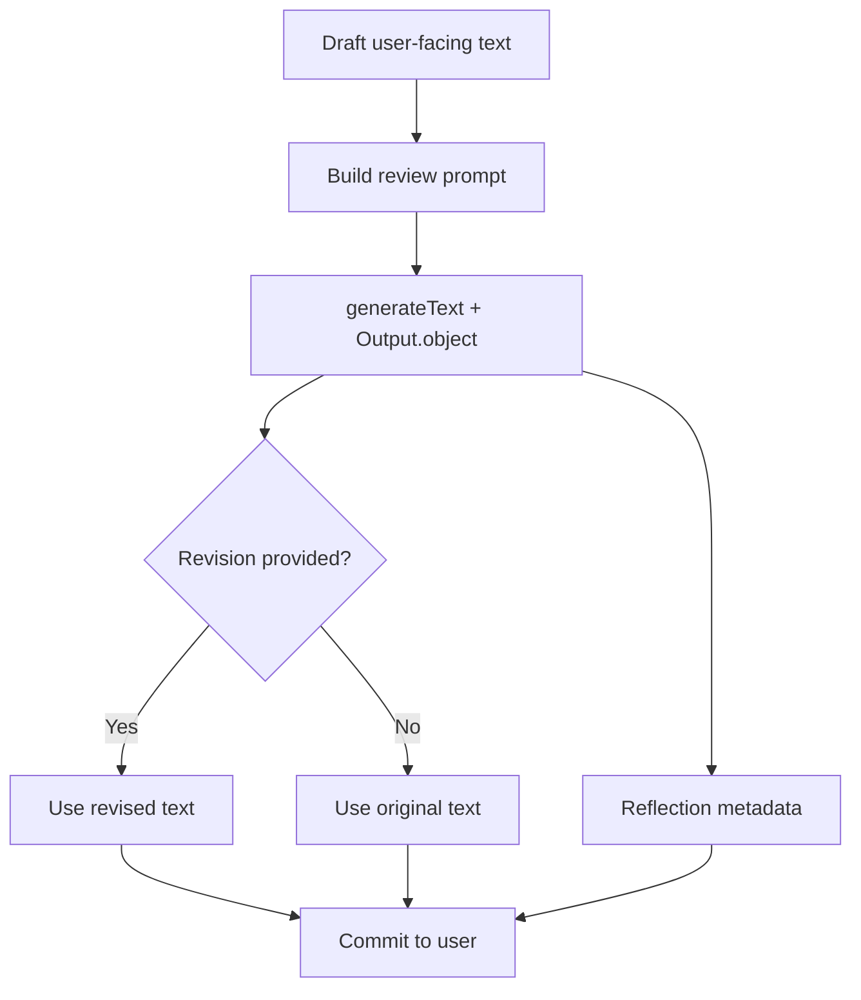

**Evaluation metrics:** review parse success, revision adoption rate, false-positive revision rate, timeout/fallback rate, and downstream user issue rate.

---

## Shared Infrastructure

### Policy RAG

**Purpose:** Ground agent responses in MassHealth policy text.

**Primary files:**

- `lib/rag/retrieve.ts`
- `lib/rag/embed.ts`
- `lib/rag/ingest.ts`

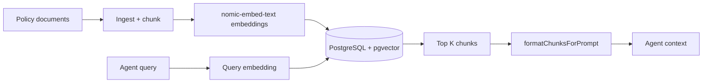

### Persistent Agent Memory

**Purpose:** Preserve benefit-advisor facts across sessions and avoid repeated questions.

**Primary files:**

- `lib/agents/memory/load.ts`
- `lib/agents/memory/save.ts`
- `database/migrations/add_user_agent_memory.sql`

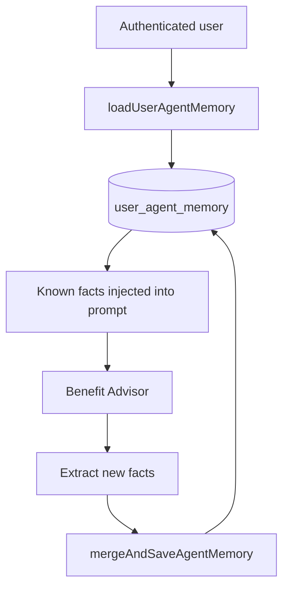

## Current Architecture Assessment Against `AI_AGENT_DESIGN.md`

| Design area | Design-doc target | Current status |
|---|---|---|
| Agent separation | Split monolithic route into specialist routes | Implemented for canonical `/api/agents/*` routes |
| Streaming | AI SDK streaming responses | Implemented for canonical agents |
| Tool use / ReAct | LLM calls typed tools | Implemented for chat, benefit advisor, form assistant, intake, appeal |
| Persistent memory | `user_agent_memory` | Implemented for Benefit Advisor |
| Reflection quality gate | Self-review before user delivery | Implemented for appeal letters and eligibility explanations |
| RAG quality metadata | Surface scores, source tiers, citation coverage | Implemented in canonical retrieval tools via `rag` tool results and `data-masshealth` annotations |
| Deterministic eligibility | Keep rules out of prompts | Preserved |
| RAG | pgvector-backed policy retrieval | Preserved |
| Vision | Document extraction agent | Implemented for PDF/image uploads |

## Remaining Architecture Gaps

1. The legacy `app/api/chat/masshealth/route.ts` still contains older mode-dispatch logic. Prefer routing new clients through `/api/agents` and retire or slim the legacy route when safe.
2. Supervisor routing does not currently include `appeal` or `vision` because those require structured inputs. If a unified UX needs them, add a separate intake step that gathers denial reason and document upload before routing.
3. Persistent memory is currently benefit-advisor specific. Form assistant and intake could benefit from explicit progress memory, but privacy and data minimization need a tighter design before expanding persistence.
4. Reflection is fail-open. That protects availability, but high-risk appeal production workflows may eventually need configurable fail-closed behavior when the review model is unavailable.
5. RAG quality metadata is now surfaced for canonical agents. Legacy compatibility endpoints should either adopt the same `rag` metadata shape or stay clearly marked as legacy.

## Recommended Next Steps

1. Add this overview to the architecture docs navigation next to `AI_AGENT_DESIGN.md`.
2. Treat `/api/agents/*` as canonical and mark `/api/chat/masshealth` as legacy compatibility.
3. Add golden eval fixtures for:
   - benefit eligibility explanations,
   - appeal letter quality,
   - fact extraction,
   - form field extraction,
   - RAG citation usefulness.
4. Add observability counters for:
   - tool-call sequences,
   - reflection revisions,
   - memory hits,
   - RAG empty-result fallbacks,
   - extraction parse failures.
5. Consider a typed shared annotation schema for `data-masshealth` so client rendering contracts stay stable across agents.
