# mHealth AI Agent Design Document

**Project:** HealthCompassMA / mHealth  
**Author:** Bin Lee  
**Date:** 2026-04-14  
**Status:** Current State Analysis + Improvement Roadmap

---

## Table of Contents

1. [Overview](#overview)
2. [Agent Inventory](#agent-inventory)
3. [Current Architecture](#current-architecture)
4. [Agent Flow Diagrams](#agent-flow-diagrams)
5. [Design Pattern Assessment](#design-pattern-assessment)
6. [Gap Analysis](#gap-analysis)
7. [Target Architecture](#target-architecture)
8. [Improvement Plan](#improvement-plan)

---

## Overview

The mHealth application contains **10 AI agents** spanning conversational assistance, structured data extraction, eligibility evaluation, appeal letter generation, and document vision processing. All agents run on a locally-hosted **Ollama** LLM (default `llama3.2` / `llava` for vision) with a **pgvector**-backed RAG system for policy document retrieval.

This document audits each agent against standard agentic AI design patterns, illustrates current and target architectures with diagrams, and provides a phased improvement plan.

---

## Agent Inventory

| # | Agent | Entry Point | LLM Used | Category |
|---|-------|-------------|----------|----------|
| 1 | **MassHealth Chat** | `route.ts → handleMassHealthChat()` | llama3.2 | Conversational Q&A |
| 2 | **Benefit Advisor** | `route.ts → handleBenefitAdvisor()` | llama3.2 | Eligibility reasoning |
| 3 | **Form Assistant** | `route.ts → handleFormAssistant()` | llama3.2 | Form guidance |
| 4 | **Application Intake** | `route.ts → handleAssistantOrIntake()` | llama3.2 | Structured interview |
| 5 | **Fact Extractor** | `lib/masshealth/fact-extraction.ts` | llama3.2 | JSON extraction |
| 6 | **Form Field Extractor** | `lib/masshealth/form-field-extraction.ts` | llama3.2 | JSON extraction |
| 7 | **Appeal Analyzer** | `app/api/appeals/analyze/route.ts` | llama3.2 | Letter generation |
| 8 | **Document Vision** | `app/api/appeals/extract-document/route.ts` | llava | OCR / image reading |
| 9 | **Eligibility Engine** | `lib/eligibility-engine.ts` | _(none — deterministic)_ | Rule engine |
| 10 | **Benefit Orchestrator** | `lib/benefit-orchestration/orchestrator.ts` | _(none — deterministic)_ | Multi-program scorer |

### Supporting Infrastructure

| Component | File | Purpose |
|-----------|------|---------|
| RAG Retrieval | `lib/rag/retrieve.ts` | pgvector cosine similarity search |
| RAG Embedding | `lib/rag/embed.ts` | nomic-embed-text via Ollama |
| RAG Ingestion | `lib/rag/ingest.ts` | Policy doc loader |
| Ollama Client | `lib/masshealth/ollama-client.ts` | Shared HTTP client |
| Prompt Builders | `lib/masshealth/chat-knowledge.ts` | System prompt templates (6 languages) |
| Session Store | `app/api/sessions/` | Collaborative social-worker sessions |

---

## Current Architecture

All chat agents are routed through a single monolithic API route. A mode switch dispatches to one of four handler functions. All LLM calls use raw `fetch()` to the Ollama HTTP API with `stream: false`.

```mermaid
graph TD
    User["👤 User / Applicant"]
    SW["👷 Social Worker"]

    subgraph "Next.js API Layer"
        ChatRoute["POST /api/chat/masshealth\n─────────────────────\nZod validation\nLanguage resolution\nMode routing"]
        AppealsRoute["POST /api/appeals/analyze"]
        VisionRoute["POST /api/appeals/extract-document"]
        SessionRoute["POST /api/sessions"]
    end

    subgraph "Mode Dispatcher (if / else switch)"
        BenefitAdvisor["handleBenefitAdvisor()"]
        FormAssistant["handleFormAssistant()"]
        AppIntake["handleAssistantOrIntake()"]
        ChatDefault["handleMassHealthChat()"]
    end

    subgraph "Extraction Agents (sub-LLM calls)"
        FactExtract["extractEligibilityFacts()\nfact-extraction.ts"]
        FormExtract["extractFormFields()\nform-field-extraction.ts"]
    end

    subgraph "Deterministic Engines"
        EligEngine["runEligibilityCheck()\neligibility-engine.ts"]
        BenefitOrch["evaluateBenefitStack()\norchestrator.ts"]
    end

    subgraph "RAG System"
        Retrieve["retrieveRelevantChunks()\nretrieve.ts"]
        Embed["generateEmbedding()\nembed.ts"]
        PGVector[("PostgreSQL\n+ pgvector")]
    end

    subgraph "LLM Backend"
        Ollama["Ollama HTTP API\nllama3.2 ── chat\nllava ──── vision"]
    end

    subgraph "Prompt Layer"
        PromptBuilders["buildXxxSystemPrompt()\nchat-knowledge.ts\n─────────────────\n🌐 EN / ZH / HT / PT / ES / VI"]
    end

    User -->|"HTTP POST + messages"| ChatRoute
    User -->|"denial details"| AppealsRoute
    User -->|"image upload"| VisionRoute
    SW -->|"create session"| SessionRoute

    ChatRoute -->|"mode=benefit_advisor"| BenefitAdvisor
    ChatRoute -->|"mode=form_assistant"| FormAssistant
    ChatRoute -->|"mode=application_intake"| AppIntake
    ChatRoute -->|"default"| ChatDefault

    BenefitAdvisor --> FactExtract
    BenefitAdvisor --> EligEngine
    BenefitAdvisor --> Retrieve
    BenefitAdvisor --> PromptBuilders
    BenefitAdvisor -->|"callOllama() — blocking"| Ollama

    FormAssistant --> FormExtract
    FormAssistant --> Retrieve
    FormAssistant --> PromptBuilders
    FormAssistant -->|"callOllama() — blocking"| Ollama

    AppIntake --> PromptBuilders
    AppIntake -->|"callOllama() — blocking"| Ollama

    ChatDefault --> Retrieve
    ChatDefault --> PromptBuilders
    ChatDefault -->|"callOllama() — blocking"| Ollama

    AppealsRoute --> Retrieve
    AppealsRoute -->|"callOllama() — blocking"| Ollama

    VisionRoute -->|"callOllama() vision — blocking"| Ollama

    FactExtract -->|"callOllama() JSON"| Ollama
    FormExtract -->|"callOllama() JSON"| Ollama

    Retrieve --> PGVector
    Embed --> PGVector

    style ChatRoute fill:#f96,stroke:#c33,color:#fff
    style Ollama fill:#4a9,stroke:#2a7,color:#fff
    style PGVector fill:#69b,stroke:#368,color:#fff
```

> **Notable problem:** The `POST /api/chat/masshealth` route is a single ~400-line file containing four agents. The LLM is only used as a text generator — the orchestration logic lives in TypeScript, not in the model's reasoning.

---

## Agent Flow Diagrams

### Agent 1 — MassHealth Chat (General Q&A)

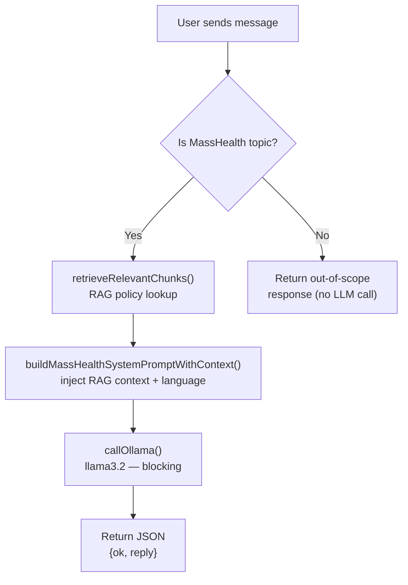

---

### Agent 2 — Benefit Advisor

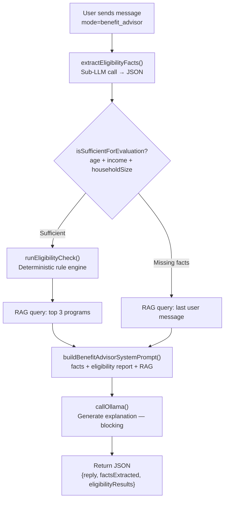

---

### Agent 3 — Form Assistant

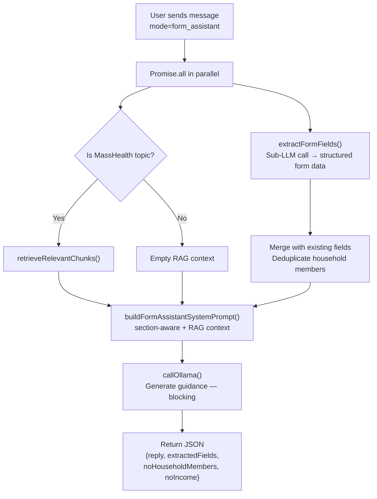

---

### Agent 4 — Application Intake

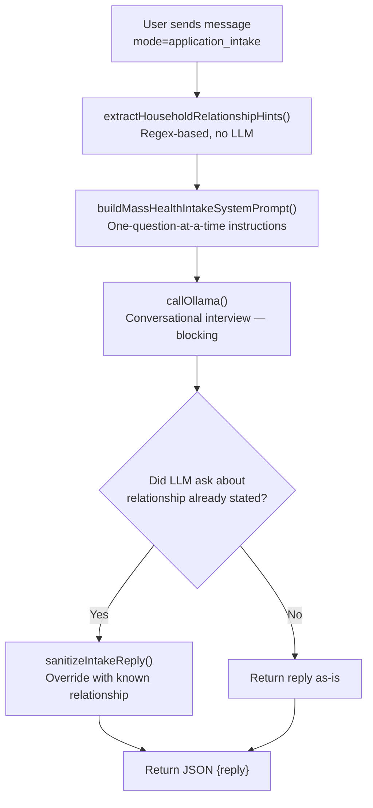

---

### Agent 7 — Appeal Analyzer

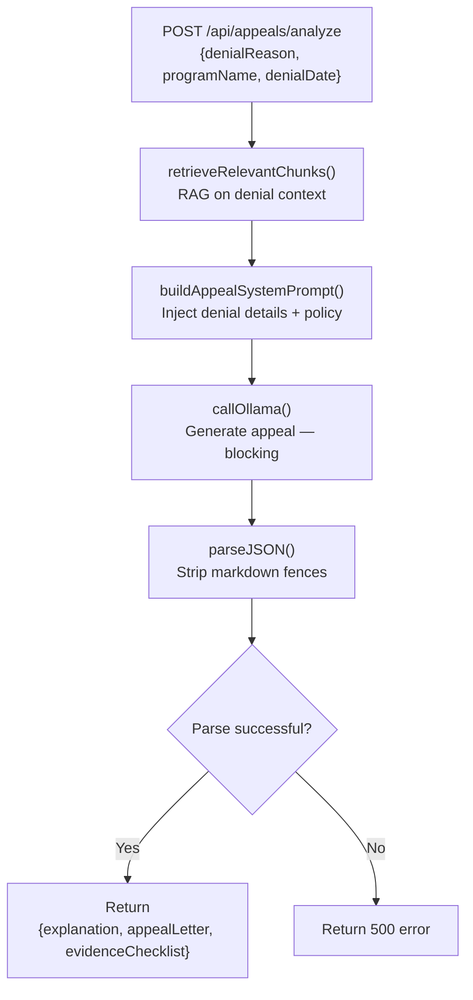

---

### Agent 8 — Document Vision (OCR)

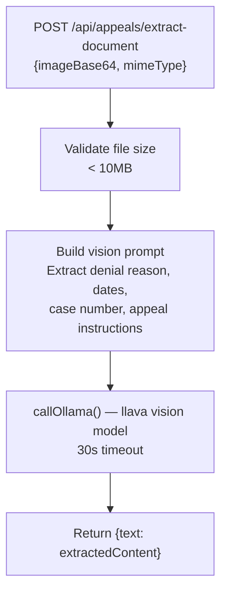

---

### Agent 9 — Eligibility Engine (Deterministic)

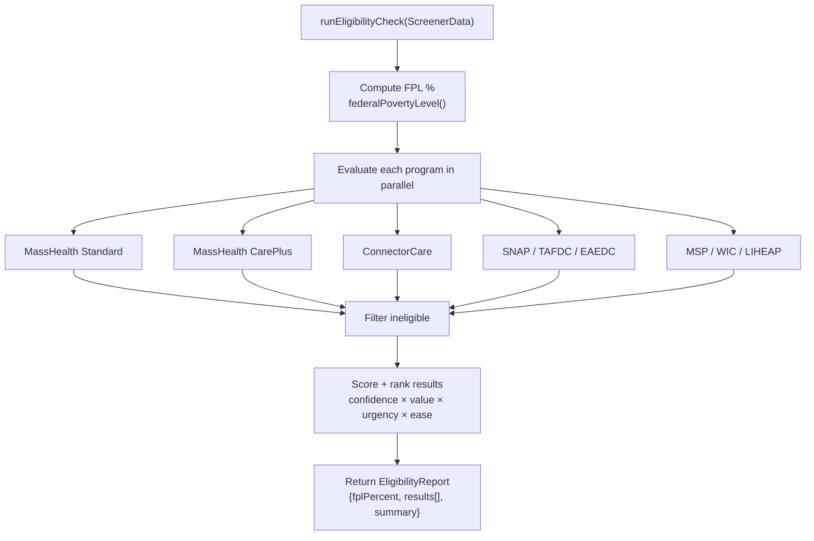

---

### Agent 10 — Benefit Orchestrator (Deterministic)

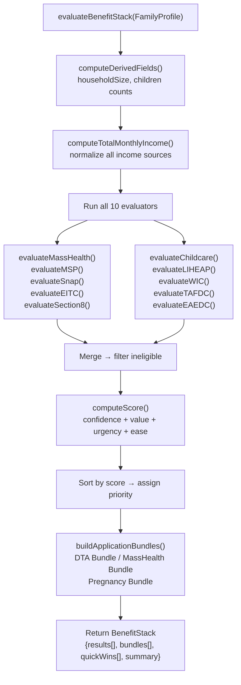

---

### RAG System Pipeline

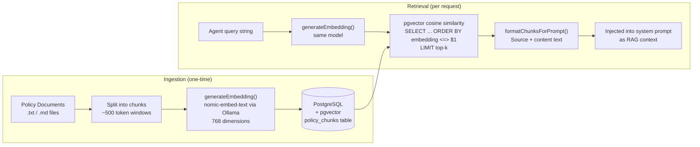

---

## Design Pattern Assessment

### Standard Agentic AI Patterns Evaluated

| Pattern | Description | Current Status | Score |
|---------|-------------|----------------|-------|
| **Tool Use / Function Calling** | LLM declares and calls typed tools autonomously | Not implemented — TypeScript decides all tool calls, LLM only generates final text | 0 / 5 |
| **ReAct Loop** (Reason → Act → Observe → Repeat) | Agent iterates until task is complete | Not implemented — one HTTP request = one LLM call, no iteration | 1 / 5 |
| **Structured Output** | Schema-enforced JSON generation with validation | Partial — manual JSON parsing with regex fence stripping; no schema enforcement by LLM | 3 / 5 |
| **RAG / Semantic Memory** | Vector retrieval augmenting LLM context | Good — pgvector + nomic-embed-text working well | 4 / 5 |
| **Multi-Agent Orchestration** | Supervisor routes to specialist sub-agents | Partial — mode switch exists but no formal agent boundary or inter-agent calls | 2 / 5 |
| **Streaming** | Token-by-token output to client | Not implemented — `stream: false` throughout; users wait for full completion | 0 / 5 |
| **Reflection / Self-Critique** | Agent evaluates and revises its own output | Not implemented | 0 / 5 |
| **Long-Term Memory** | User facts persist across sessions | Not implemented — stateless per request; facts re-extracted every turn | 1 / 5 |
| **Error Recovery / Retry** | Agent retries or gracefully falls back | Partial — graceful degradation to empty, no intelligent retry | 2 / 5 |
| **Observability** | Per-step traces, token counts, latency | Partial — `logChatRequest()` logs at request level, no step-level spans | 2 / 5 |

**Total Score: 15 / 50**

> The app has **excellent domain logic** — rule engines, RAG, multi-language prompts, fact extraction — but is **architecturally pre-agentic**: the LLM is used purely as a text generator, not as a reasoning engine that self-directs its tool use.

---

## Gap Analysis

### Gap 1 — LLM Does Not Control Tool Calls

**Current behavior:**

```typescript
// route.ts — TypeScript decides everything; LLM only writes final reply
const facts  = await extractEligibilityFacts(payload.messages, language)  // hardcoded
const report = runEligibilityCheck(applyFactDefaults(facts))               // hardcoded
const chunks = await retrieveRelevantChunks(ragQuery, RAG_TOP_K_ADVISOR)   // hardcoded
const reply  = await callOllama({ systemPrompt, messages })                // LLM is last step only
```

**What this means:** No matter what the user says, the same pipeline always runs. The LLM cannot decide to skip eligibility check, ask a clarifying question first, or call a tool the developer didn't anticipate.

**Target behavior:**

```typescript
import { streamText, stepCountIs } from "ai"

const result = streamText({
  model: ollama("llama3.2"),
  tools: { extract_facts, check_eligibility, retrieve_policy, ask_clarification },
  stopWhen: stepCountIs(5),   // LLM can loop: reason → call tool → observe → reason again
})
```

---

### Gap 2 — No Streaming Responses

**Current:** `callOllama({ stream: false })` — user waits 5–15 seconds for a JSON blob.

**Impact:** Poor UX, no perceived progress, mobile users on slow connections time out.

**Target:** `streamText()` → tokens flow to the browser immediately as the model generates them.

---

### Gap 3 — Monolithic Route (One God File)

**Current:** `app/api/chat/masshealth/route.ts` contains 4 agents in one ~400-line file:

```
POST /api/chat/masshealth
  ├── mode=benefit_advisor     → handleBenefitAdvisor()
  ├── mode=form_assistant      → handleFormAssistant()
  ├── mode=application_intake  → handleAssistantOrIntake()
  └── default                  → handleMassHealthChat()
```

**Impact:** Cannot be scaled, tested, or deployed independently. One bug affects all agents.

---

### Gap 4 — No Long-Term Agent Memory

**Current:** Each request re-extracts all facts from scratch. If a user told the system their age and income in turn 2, turn 10 re-extracts it from the full message history again.

**Impact:** Wasted LLM calls, inconsistent fact state, inability to personalize across sessions.

---

### Gap 5 — No Reflection Quality Gate

**Current:** Appeal letters are generated in one shot and returned directly to users with no self-evaluation.

**Impact:** LLM hallucinations in legal/medical documents go uncaught before reaching vulnerable users.

---

## Target Architecture

### High-Level Target

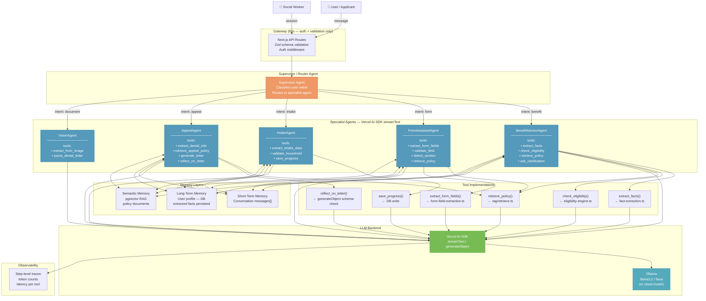

---

### Target ReAct Loop for Benefit Advisor

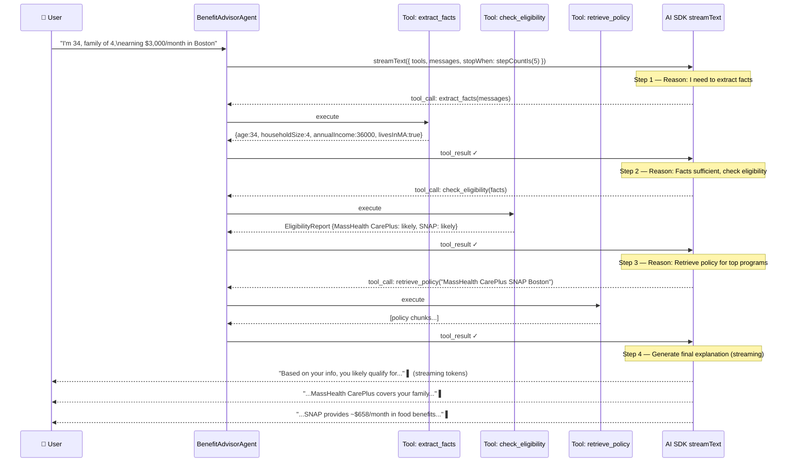

---

### Memory Architecture (Target)

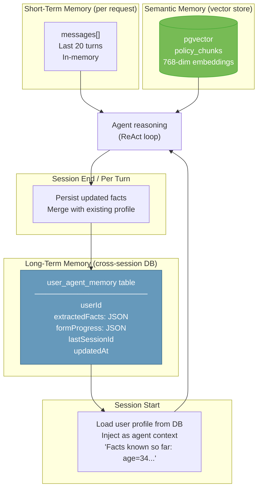

---

## Improvement Plan

### Phase 1 — Streaming (High Impact · Low Risk)

**Goal:** Users see tokens immediately instead of waiting 5–15 seconds for a full JSON blob.

**Changes:**
- Install `ai` (Vercel AI SDK) and create an Ollama-compatible provider wrapper
- Replace `callOllama({ stream: false })` with `streamText()`
- Change all chat route handlers to return `result.toUIMessageStreamResponse()`
- Update frontend chat components to use `useChat()` from `@ai-sdk/react`

**Files affected:**
- `lib/masshealth/ollama-client.ts` — add streaming variant
- `app/api/chat/masshealth/route.ts` — switch to stream response
- All chat UI components

**Before:**
```typescript
// Blocks until full completion (5–15s)
const reply = await callOllama({ stream: false, ... })
return NextResponse.json({ ok: true, reply })
```

**After:**
```typescript
const result = streamText({
  model: ollama("llama3.2"),
  system: buildBenefitAdvisorSystemPrompt(language, facts, eligibilityReport, ragContext),
  messages,
})
return result.toUIMessageStreamResponse()
```

---

### Phase 2 — Tool Use + ReAct Loop (Correct the Core Pattern)

**Goal:** The LLM decides which tools to call. Enables true agentic reasoning chains.

**New file structure:**
```
lib/agents/
  benefit-advisor/
    tools.ts       ← typed tool definitions
    prompts.ts     ← system prompt builder
    route.ts       ← streamText endpoint
  form-assistant/
    tools.ts
    prompts.ts
    route.ts
  intake/
    tools.ts
    route.ts
  appeal/
    tools.ts
    route.ts
```

**Example — Benefit Advisor tools:**
```typescript
// lib/agents/benefit-advisor/tools.ts
import { tool } from "ai"
import { z } from "zod"

export const benefitAdvisorTools = {
  extract_eligibility_facts: tool({
    description: "Extract age, income, household size, citizenship, and other eligibility facts from the conversation",
    parameters: z.object({ messages: z.array(messageSchema) }),
    execute: ({ messages }) => extractEligibilityFacts(messages, "en"),
  }),

  check_eligibility: tool({
    description: "Run the MassHealth eligibility rule engine and get program recommendations",
    parameters: screenerDataSchema,
    execute: (facts) => runEligibilityCheck(applyFactDefaults(facts)),
  }),

  retrieve_policy: tool({
    description: "Search MassHealth policy documents for relevant information",
    parameters: z.object({ query: z.string().describe("Search query about MassHealth policy") }),
    execute: ({ query }) => retrieveRelevantChunks(query, 5),
  }),

  ask_clarification: tool({
    description: "Ask the user for a specific missing piece of information",
    parameters: z.object({ question: z.string(), missingFact: z.string() }),
    // No execute — this is a UI tool that surfaces the question to the user
  }),
}
```

**Benefit advisor route:**
```typescript
// app/api/agents/benefit-advisor/route.ts
export async function POST(req: Request) {
  const { messages, language } = await req.json()

  const result = streamText({
    model: ollama("llama3.2"),
    system: buildBenefitAdvisorSystemPrompt(language),
    messages,
    tools: benefitAdvisorTools,
    stopWhen: stepCountIs(5),  // enables ReAct loop
  })

  return result.toUIMessageStreamResponse()
}
```

---

### Phase 3 — Agent Separation

**Goal:** Decompose the monolithic route into independently deployable, testable agent modules.

**New route structure:**
```
app/api/agents/
  benefit-advisor/route.ts    ← was mode=benefit_advisor
  form-assistant/route.ts     ← was mode=form_assistant
  intake/route.ts             ← was mode=application_intake
  chat/route.ts               ← was default mode
  appeal/route.ts             ← was /api/appeals/analyze
  vision/route.ts             ← was /api/appeals/extract-document
```

**Supervisor agent** (optional, for single-endpoint clients):
```typescript
// app/api/agents/route.ts — Supervisor
import { generateText, Output } from "ai"
import { z } from "zod"

const intentResult = await generateText({
  model: ollama("llama3.2"),
  output: Output.object({
    schema: z.object({
      intent: z.enum(["benefit_advisor", "form_assistant", "intake", "appeal", "general"]),
    }),
  }),
  prompt: `Classify this user message: "${lastMessage}"`,
})

// Route to appropriate specialist agent
return fetch(`/api/agents/${intentResult.object.intent}`, { method: "POST", body: req.body })
```

---

### Phase 4 — Persistent Long-Term Memory

**Goal:** Facts extracted in turn 2 are available in turn 10 without re-extraction. User profile persists across sessions.

**Schema:**
```sql
CREATE TABLE user_agent_memory (
  id           uuid PRIMARY KEY DEFAULT gen_random_uuid(),
  user_id      text NOT NULL,
  session_id   text,
  extracted_facts  jsonb DEFAULT '{}',    -- ScreenerData partial
  form_progress    jsonb DEFAULT '{}',    -- FormFields partial
  created_at   timestamptz DEFAULT now(),
  updated_at   timestamptz DEFAULT now()
);
```

**Agent integration:**
```typescript
// At session start — inject known facts into system prompt
const memory = await loadUserAgentMemory(userId)
const systemPrompt = buildBenefitAdvisorSystemPrompt(language, memory.extractedFacts)

// After each turn — persist new facts
const newFacts = await extractEligibilityFacts(messages, language)
await mergeAndSaveAgentMemory(userId, { extractedFacts: newFacts })
```

---

### Phase 5 — Reflection Quality Gate

**Goal:** Appeal letters and eligibility explanations are self-evaluated before reaching users.

**Implementation:**
```typescript
// After generating appeal letter
const generated = await generateText({ model, prompt: appealPrompt })

// Reflection step — agent critiques its own output
import { generateText, Output } from "ai"

const review = await generateText({
  model: ollama("llama3.2"),
  output: Output.object({
    schema: z.object({
      factuallyAccurate: z.boolean(),
      clearToLayperson: z.boolean(),
      hasSpecificEvidence: z.boolean(),
      issues: z.array(z.string()),
      revisedLetter: z.string().optional(),
    }),
  }),
  prompt: `You are a MassHealth appeals expert. Review this appeal letter for accuracy,
           clarity, and completeness. If it has issues, provide a revised version.
           Letter: ${generated.text}`,
})

const finalLetter = review.object.revisedLetter ?? generated.text
```

---

### Improvement Roadmap Summary

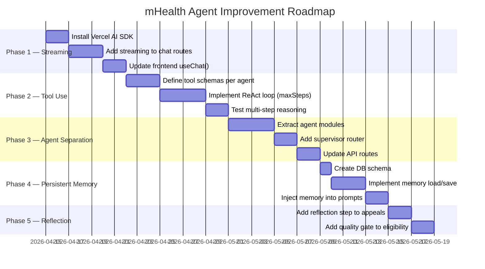

### Priority Matrix

| Phase | Change | User Impact | Tech Risk | Effort |
|-------|--------|-------------|-----------|--------|
| 1 — Streaming | `streamText()` + `useChat()` | High — immediate UX win | Low | Small |
| 2 — Tool Use | Typed tools + `maxSteps` ReAct | High — true agent reasoning | Medium | Medium |
| 3 — Agent Separation | Split monolithic route | Medium — maintainability | Low | Medium |
| 4 — Persistent Memory | DB-backed user profile | High — eliminates re-extraction | Medium | Medium |
| 5 — Reflection | Self-critique for appeal letters | Medium — quality gate | Low | Small |

---

## What the App Does Well (Preserve)

These patterns are well-implemented and should be kept intact during refactoring:

- **Eligibility rule engine** (`eligibility-engine.ts`) — deterministic, thorough, correct. Do not replace with LLM logic.
- **Benefit orchestrator** (`orchestrator.ts`) — scoring, ranking, and application bundling is solid.
- **RAG pipeline** — pgvector + nomic-embed-text is an appropriate choice for policy document retrieval.
- **Multi-language system prompts** — 6-language support with language-aware prompt builders.
- **Graceful degradation** — RAG and extraction failures silently degrade rather than crashing the conversation.
- **Zod validation** — all request payloads are validated; this is correct and should be extended to tool parameters.
- **Structured fact/field extraction** — the underlying extraction logic is sound; it just needs to be wrapped as formal tool definitions.

---

*Generated: 2026-04-14 | mHealth / HealthCompassMA*
