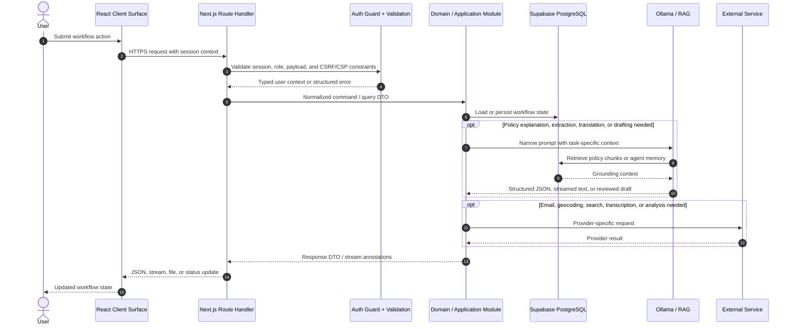

# HealthCompass MA App Architecture Diagram

This diagram reflects the current repository architecture: a Next.js modular monolith with role-based portals, typed route handlers, deterministic MassHealth domain engines, Supabase/PostgreSQL persistence, pgvector-backed RAG, local Ollama models, and production deployment through Traefik/Docker.

## Color Legend

| Color  | Component Type                           |
| ------ | ---------------------------------------- |
| Blue   | User-facing client surfaces              |
| Purple | React UI and client state                |
| Orange | Next.js API boundary and auth            |
| Green  | Deterministic domain/application logic   |
| Teal   | Data, storage, and search                |
| Pink   | AI, RAG, extraction, and agent workflows |
| Yellow | External integrations                    |
| Gray   | Deployment and observability             |

## System Architecture

```mermaid
flowchart LR
  subgraph Internet["Internet / Users"]
    Applicant["Applicant / Patient"]
    SocialWorker["Social Worker"]
    Reviewer["Reviewer"]
    Admin["Admin"]
    MobileUser["Mobile Upload / Verify User"]
  end

  subgraph Edge["Edge And Runtime"]
    Traefik["Traefik Reverse Proxy\nTLS termination, host/path routing"]
    NextApp["Next.js 16 Standalone App\nApp Router deployment"]
    MCP["MCP Server\n/mcp and OAuth routes"]
  end

  subgraph UI["React Client Surfaces"]
    PublicPages["Public Pages\nLanding, prescreener, privacy"]
    ApplicantPortal["Applicant Portal\nApplication, profile, status, sessions"]
    SocialWorkerPortal["Social Worker Portal\nPatients, messaging, sessions"]
    ReviewerPortal["Reviewer Portal\nCases, income review, audit"]
    AdminPortal["Admin Portal\nUsers, roles, companies, analytics"]
    MobileFlows["Mobile Web Flows\nDocument upload, ID verification"]
    ClientState["Client State\nRedux slices, hooks, UI providers"]
  end

  subgraph API["Next.js API Boundary"]
    AuthRoutes["Auth + Session Routes\nSupabase auth, passkeys, MFA, dev auth"]
    AppRoutes["Application Routes\nDrafts, documents, PDF generation"]
    BenefitRoutes["Benefit Orchestration Routes\nProfile and evaluation"]
    AgentRoutes["Agent Routes\nSupervisor, chat, benefit advisor,\nform assistant, intake, vision"]
    VerificationRoutes["Identity + Income Routes\nLicense, QR/mobile scan, reviewer flows"]
    CollaborationRoutes["Collaboration Routes\nSessions, messages, notifications"]
    AdminRoutes["Admin Routes\nUsers, roles, exports, PHI audit"]
    UtilityRoutes["Utility Routes\nAddress, companies, health, cron, growth"]
  end

  subgraph Security["Access Control Boundary"]
    Middleware["proxy.ts\nCSP nonce and request security"]
    Guards["Server Auth Guards\nrequire-auth, require-admin,\nrequire-reviewer, require-social-worker"]
    Validation["Request Validation\nZod schemas and typed DTOs"]
  end

  subgraph Domain["Application And Domain Logic"]
    IntakeEngine["Application Intake\nACA-3 / ACA-3-AP checks"]
    EligibilityEngine["MassHealth Eligibility Engines\nACA-3, ACA-3-AP, FPL rules"]
    BenefitEngine["Benefit Orchestrator\nMassHealth, SNAP, WIC, EITC,\nTAFDC, Section 8, LIHEAP"]
    IncomeEngine["Income Verification Engine\nEvidence checks and reviewer decisions"]
    IdentityEngine["Identity Verification\nAAMVA parsing and license scoring"]
    AppealsEngine["Appeals Logic\nCategories, personalization, drafts"]
    NotificationService["Notification Service\nEmail templates and in-app events"]
    PrivacyPhi["Privacy / PHI Controls\nToken restore, encryption, audit"]
  end

  subgraph AI["AI And Retrieval"]
    SupervisorAgent["Supervisor Agent\nIntent routing"]
    ChatAgent["MassHealth Chat Agent\nPolicy-grounded answers"]
    BenefitAgent["Benefit Advisor Agent\nFact extraction, eligibility,\nreflection quality gate"]
    FormAgent["Form Assistant Agent\nField extraction and UI updates"]
    IntakeAgent["Intake Agent\nHousehold relationship hints"]
    VisionAgent["Vision / Document Agent\nPDF, ID, and document extraction"]
    Rag["Policy RAG\nTask-specific retrieval"]
    Embeddings["Embedding Pipeline\nnomic-embed-text"]
    Ollama["Ollama Models\nllama3.2, vision, extraction"]
    Reflection["Reflection Quality Gates\nEligibility and appeal output review"]
  end

  subgraph Data["Supabase And PostgreSQL"]
    SupabaseAuth["Supabase Auth\nauth.users"]
    Postgres["PostgreSQL Public Schema\nApplications, users, sessions,\nmessages, reviews, audits"]
    RLS["RLS Policies\nAccess functions and least privilege"]
    Storage["Supabase Storage\nApplication documents and uploads"]
    PgVector["pgvector\npolicy_documents, policy_chunks"]
    Memory["Agent Memory\nuser_agent_memory"]
    PhiAudit["PHI Audit Tables\nAccess and restore events"]
  end

  subgraph External["External Services"]
    Resend["Resend\nTransactional email"]
    GeoLookup["Google / Nominatim\nAddress validation"]
    NPPES["NPPES\nCompany/provider search"]
    Whisper["Whisper CLI\nVoice transcription"]
    AnalysisService["Optional Python Analysis Service\nFastAPI profile"]
  end

  subgraph Observability["Operations"]
    OTel["OpenTelemetry\nServer traces"]
    Vector["Vector\nContainer log shipping"]
    OpenObserve["OpenObserve\nLogs and traces"]
    Tests["Quality Gates\nVitest, Playwright, Storybook"]
  end

  Applicant --> Traefik
  SocialWorker --> Traefik
  Reviewer --> Traefik
  Admin --> Traefik
  MobileUser --> Traefik

  Traefik --> NextApp
  Traefik --> MCP

  NextApp --> PublicPages
  NextApp --> ApplicantPortal
  NextApp --> SocialWorkerPortal
  NextApp --> ReviewerPortal
  NextApp --> AdminPortal
  NextApp --> MobileFlows

  PublicPages --> ClientState
  ApplicantPortal --> ClientState
  SocialWorkerPortal --> ClientState
  ReviewerPortal --> ClientState
  AdminPortal --> ClientState
  MobileFlows --> ClientState

  ClientState --> AuthRoutes
  ClientState --> AppRoutes
  ClientState --> BenefitRoutes
  ClientState --> AgentRoutes
  ClientState --> VerificationRoutes
  ClientState --> CollaborationRoutes
  ClientState --> AdminRoutes
  ClientState --> UtilityRoutes

  AuthRoutes --> Middleware
  AppRoutes --> Guards
  BenefitRoutes --> Guards
  AgentRoutes --> Guards
  VerificationRoutes --> Guards
  CollaborationRoutes --> Guards
  AdminRoutes --> Guards
  UtilityRoutes --> Validation
  Guards --> Validation
  Middleware --> Validation

  Validation --> IntakeEngine
  Validation --> EligibilityEngine
  Validation --> BenefitEngine
  Validation --> IncomeEngine
  Validation --> IdentityEngine
  Validation --> AppealsEngine
  Validation --> NotificationService
  Validation --> PrivacyPhi
  Validation --> SupervisorAgent

  SupervisorAgent --> ChatAgent
  SupervisorAgent --> BenefitAgent
  SupervisorAgent --> FormAgent
  SupervisorAgent --> IntakeAgent
  AgentRoutes --> VisionAgent

  ChatAgent --> Rag
  BenefitAgent --> Rag
  BenefitAgent --> EligibilityEngine
  BenefitAgent --> Memory
  BenefitAgent --> Reflection
  FormAgent --> Rag
  FormAgent --> IntakeEngine
  IntakeAgent --> IntakeEngine
  VisionAgent --> Ollama
  VisionAgent --> Storage
  Rag --> Embeddings
  Embeddings --> PgVector
  ChatAgent --> Ollama
  BenefitAgent --> Ollama
  FormAgent --> Ollama
  IntakeAgent --> Ollama
  Reflection --> Ollama

  IntakeEngine --> Postgres
  EligibilityEngine --> Postgres
  BenefitEngine --> Postgres
  IncomeEngine --> Postgres
  IdentityEngine --> Postgres
  AppealsEngine --> Postgres
  NotificationService --> Postgres
  PrivacyPhi --> PhiAudit
  PrivacyPhi --> Postgres
  AppRoutes --> Storage
  AuthRoutes --> SupabaseAuth
  Postgres --> RLS
  Postgres --> SupabaseAuth
  Memory --> Postgres
  PhiAudit --> Postgres

  NotificationService --> Resend
  UtilityRoutes --> GeoLookup
  UtilityRoutes --> NPPES
  CollaborationRoutes --> Whisper
  VerificationRoutes --> AnalysisService

  NextApp --> OTel
  NextApp --> Vector
  Ollama --> Vector
  Vector --> OpenObserve
  OTel --> OpenObserve
  NextApp -. validated by .-> Tests

  classDef client fill:#dbeafe,stroke:#2563eb,color:#0f172a
  classDef ui fill:#ede9fe,stroke:#7c3aed,color:#0f172a
  classDef edge fill:#e5e7eb,stroke:#4b5563,color:#111827
  classDef api fill:#fed7aa,stroke:#ea580c,color:#111827
  classDef security fill:#fee2e2,stroke:#dc2626,color:#111827
  classDef domain fill:#dcfce7,stroke:#16a34a,color:#052e16
  classDef ai fill:#fce7f3,stroke:#db2777,color:#500724
  classDef data fill:#ccfbf1,stroke:#0d9488,color:#042f2e
  classDef external fill:#fef3c7,stroke:#d97706,color:#451a03
  classDef ops fill:#f3f4f6,stroke:#6b7280,color:#111827

  class Applicant,SocialWorker,Reviewer,Admin,MobileUser client
  class PublicPages,ApplicantPortal,SocialWorkerPortal,ReviewerPortal,AdminPortal,MobileFlows,ClientState ui
  class Traefik,NextApp,MCP edge
  class AuthRoutes,AppRoutes,BenefitRoutes,AgentRoutes,VerificationRoutes,CollaborationRoutes,AdminRoutes,UtilityRoutes api
  class Middleware,Guards,Validation security
  class IntakeEngine,EligibilityEngine,BenefitEngine,IncomeEngine,IdentityEngine,AppealsEngine,NotificationService,PrivacyPhi domain
  class SupervisorAgent,ChatAgent,BenefitAgent,FormAgent,IntakeAgent,VisionAgent,Rag,Embeddings,Ollama,Reflection ai
  class SupabaseAuth,Postgres,RLS,Storage,PgVector,Memory,PhiAudit data
  class Resend,GeoLookup,NPPES,Whisper,AnalysisService external
  class OTel,Vector,OpenObserve,Tests ops
```

## Primary Runtime Flow

