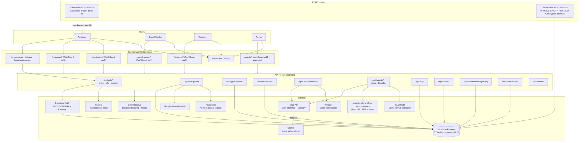

# HealthCompass MA — System Architecture

> **Audience:** Engineers, security reviewers, and technical auditors.  
> **Last updated:** 2026-05-28

---

## 1. Overview

HealthCompass MA is a Next.js 16 App Router application that enables applicants to apply for MassHealth coverage and lets social workers guide them through the process in real time. It is deployed on Vercel (Fluid Compute) with Supabase as the primary data platform.

---

## 2. System Architecture Diagram



---

## 3. Authentication & Authorization

### Auth levels

| Level | Applies to | Mechanism |
|-------|-----------|-----------|
| `aal1` | Applicant, Social Worker, Reviewer | Supabase JWT (email + password or OAuth) |
| `aal2` | Admin | TOTP MFA required (enforced in `require-admin.ts`) |
| `aal2 + passkey` | Admin (sensitive ops) | TOTP MFA + WebAuthn passkey |

### Role hierarchy

```
admin
  └─► social_worker
  └─► reviewer
  └─► supervisor
  └─► read_only_staff
  └─► case_reviewer
applicant  (default role on registration)
```

Admin MFA is enforced via `admin_settings.require_2fa_admin = true`. Social worker and reviewer MFA is planned for a future sprint.

### Row-Level Security

All 37 Supabase tables have RLS enabled. Key helper functions defined in `supabase/migrations/20260101000000_baseline_schema.sql`:

```sql
public.request_user_id()   -- extracts auth.uid() from JWT claims
public.is_staff()          -- true for admin · reviewer · supervisor · read_only_staff
```

---

## 4. PHI Data Flow

```
Browser
  │  HTTPS/TLS 1.2+
  ▼
Vercel Edge (HSTS 2-year preload)
  │
  ▼
Next.js API Route (Fluid Compute)
  │
  ├─► lib/user-profile/encrypt.ts  ← encryptField() / decryptField()
  │     AES-256-GCM, PBKDF2-derived key from PROFILE_ENCRYPTION_KEY
  │     Writes to *_encrypted columns in Supabase
  │
  └─► Supabase PostgreSQL
        Database-at-rest: AWS RDS encryption (AES-256, Supabase-managed)
        Table-at-rest: RLS enforces per-user row isolation
```

### Encrypted PHI columns

| Field | Column |
|-------|--------|
| First name | `applicants.first_name_encrypted` |
| Last name | `applicants.last_name_encrypted` |
| Address | `applicants.address_encrypted` |
| Phone | `applicants.phone_encrypted` |
| SSN | `applicants.ssn_encrypted` |
| Bank data | `user_profiles.bank_data` (AES-256-GCM, PBKDF2 key) |

---

## 5. AI / LLM Integration

| Route | Provider | Purpose |
|-------|----------|---------|
| `/api/chat/masshealth` | Groq (primary) → Ollama (fallback) | Benefits advisor chat, voice translation |
| `/api/agents/benefits` | Groq | Automated benefit stack analysis |
| `/api/agents/vision` | GLM-OCR + masshealth-analysis | Scanned PDF data extraction |
| `/api/rag/search` | pgvector (Supabase) | Knowledge base semantic search |
| `/api/chat/transcribe` | Whisper (local) | Voice message → text transcription |

**Groq BAA note:** Groq Inc. must sign a Business Associate Agreement before this application processes real PHI in production (see `HIPAA_COMPLIANCE.md` Section 8).

---

## 6. Key Directory Structure

```
app/
├── admin/           # Admin portal — aal2+passkey, AdminAuthGate, AdminSidebar
├── application/     # ACA-3 form wizard — multi-step with reducer + mappings
├── customer/        # Patient dashboard, sessions, profile
├── social-worker/   # SW portal — SWSessionProvider keeps WebRTC alive across nav
├── reviewer/        # Case review queue
├── masshealth-appeals/ # Appeal drafting
└── api/             # All API routes (no page routes here)

components/
├── admin/           # AdminAuthGate, AdminMfaEnrollFlow, AdminPasskeyButton, AdminSidebar
├── application/aca3/ # Form wizard UI (kebab-case.tsx convention)
├── chat/            # Chat, voice, Q&A widgets (kebab-case.tsx convention)
├── benefit-orchestration/ # FamilyProfileWizard, BenefitProgramCard (PascalCase legacy)
└── collaborative-sessions/ # SessionRoom, FloatingSessionBar, etc. (PascalCase legacy)

lib/
├── auth/            # require-auth.ts, require-admin.ts, require-social-worker.ts
├── masshealth/      # ACA-3 eligibility engines, constants, types, helpers
├── benefit-orchestration/ # Orchestrator + 9 program evaluators
├── eligibility-engine.ts  # Prescreener eligibility (FPL-based)
├── redux/           # Store, slices (profile, appeals, sessions, notifications)
├── server/          # logger.ts (PII-redacting), rate-limit.ts
└── user-profile/    # encrypt.ts (AES-256-GCM field encryption)

supabase/migrations/ # All 19+ tracked migrations — source of truth for schema
```

---

## 7. External Service Dependencies

| Service | Purpose | PHI exposure | BAA needed |
|---------|---------|-------------|-----------|
| Supabase | DB + Auth + Storage | High — all PHI | Yes (Enterprise) |
| Vercel | App hosting + Fluid Compute | Medium — in-memory | Yes (Enterprise) |
| Groq | LLM inference | Medium — prompts may contain PHI | Yes |
| Resend | Transactional email | Low — PII only | Yes |
| OpenObserve | Logs + distributed traces | Low — PII redacted | Yes |
| Google Geocoding | Address validation | Low — address only | Verify |
| Nominatim | Address fallback | Low | No (OSM, self-hostable) |
| Ollama | Local LLM fallback | None in production | N/A |
| Whisper | Voice transcription | Low — audio files | N/A (local) |
| masshealth-analysis | PDF/appeal analysis | Medium | Internal service |

---

## 8. Observability

Structured JSON logs are shipped to a self-hosted **OpenObserve** instance via `lib/server/logger.ts`. OpenTelemetry auto-instrumentation ships distributed traces over OTLP/HTTP.

All log payloads automatically redact keys matching: `authorization`, `token`, `access_token`, `refresh_token`, `password`, `secret`, `ssn`, `dob`.

See `README.md → Observability` for configuration and query examples.

---

## 9. Known Architecture Gaps

| # | Gap | Severity | Status |
|---|-----|----------|--------|
| 1 | Social worker / reviewer MFA not enforced | High | Planned Sprint 1 |
| 2 | PHI access audit logging (reads, not just writes) | High | Planned Sprint 2 |
| 3 | In-memory rate limiter breaks on multi-instance | High | Planned Sprint 2 |
| 4 | DOB stored plaintext | Medium | Planned Sprint 3 |
| 5 | `script-src 'unsafe-inline'` in CSP | High | Planned Sprint 2 |
| 6 | Customer / reviewer layout missing idle timeout | Medium | Planned Sprint 1 |

Full gap matrix: [`HIPAA_COMPLIANCE.md`](../HIPAA_COMPLIANCE.md) Section 9.
