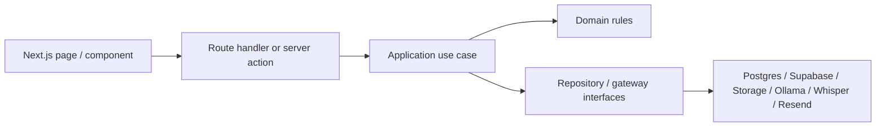

# HealthCompass MA — Architecture Refactor Plan

**Author:** Codex
**Status:** Proposed
**Scope:** Next.js application architecture, maintainability, module boundaries, AI/LLM service design

---

## 1. Goals

This repo has working feature separation at the product level, but the code organization is still too horizontal. The main maintainability issues are:

- domain logic is spread across `lib/` by technical concern rather than feature ownership
- some feature workflows are concentrated in very large files
- route handlers mix validation, orchestration, prompt assembly, retrieval, and transport concerns
- Redux is carrying some workflow state that should stay local to a feature boundary

The target state is a **modular monolith**:

- one deployable Next.js app
- clear bounded contexts by feature
- pure domain logic isolated from UI and framework code
- infrastructure adapters behind interfaces
- route handlers and pages kept thin

This is the right tradeoff for the current system because the app already spans:

- eligibility rules
- application intake
- benefit orchestration
- document extraction
- appeals
- identity verification
- real-time collaboration
- chat and RAG-backed assistant flows

That is too much domain surface for a flat `lib/` layout, but not enough operational complexity to justify a microservice split.

---

## 2. Current State Summary

The repo already contains strong building blocks:

- route surface in `app/api/**`
- reusable domain logic in modules such as `lib/benefit-orchestration/*`
- DB access modules in `lib/db/*`
- AI-related logic in `lib/masshealth/*`, `lib/rag/*`, `lib/appeals/*`
- shared UI components in `components/**`

The main hotspots are concentrated in a few oversized files:

- `components/application/aca3/form-wizard.tsx`
- `components/application/aca3/intake-chat.tsx`
- `components/application/aca3/application-assistant.tsx`
- `lib/masshealth/chat-knowledge.ts`
- `app/api/chat/masshealth/route.ts`

These files are doing too many jobs at once:

- workflow state management
- rendering
- transformation/mapping
- retrieval and prompt construction
- validation and business branching

That makes them expensive to test and risky to change.

---

## 3. Target Architecture

### 3.1 Architectural style

Use a **feature-first modular monolith** with internal layering inside each feature:

- `domain/`: pure business rules, entities, value objects, policy evaluation
- `application/`: use cases and orchestration
- `infrastructure/`: DB, Supabase, storage, Ollama, Whisper, Resend, external APIs
- `ui/`: React components, local hooks, page presenters
- `api/`: route handlers or request/response mappers

### 3.2 Dependency direction

Allowed dependency direction:

```text
ui -> application -> domain
api -> application -> domain
application -> infrastructure
domain -> no framework or transport dependencies
shared -> imported by modules only when truly cross-cutting
```

Disallowed patterns:

- `ui` importing DB modules directly
- `domain` importing `next/*`, `react`, `pg`, `supabase`, or fetch clients
- route handlers calling low-level helpers from many unrelated folders
- feature code importing another feature's infrastructure directly

### 3.3 Delivery flow



---

## 4. Target Folder Structure

Recommended structure:

```text
app/
  api/
  (routes only)

src/
  modules/
    application-intake/
      api/
      application/
      domain/
      infrastructure/
      ui/
      index.ts
    chat-assistant/
      api/
      application/
      domain/
      infrastructure/
      ui/
      index.ts
    benefit-stack/
      api/
      application/
      domain/
      infrastructure/
      ui/
      index.ts
    appeals/
      api/
      application/
      domain/
      infrastructure/
      ui/
      index.ts
    identity-verification/
      api/
      application/
      domain/
      infrastructure/
      ui/
      index.ts
    notifications/
    user-profile/
    collaborative-sessions/
  shared/
    kernel/
      errors/
      result/
      types/
    platform/
      auth/
      config/
      logger/
      telemetry/
    ui/
    test/
```

If you do not want to introduce `src/` immediately, the same structure can live under `lib/modules/` as an interim step. The boundary matters more than the top-level folder name.

---

## 5. Bounded Contexts For This Repo

### 5.1 Application Intake

Owns:

- ACA-3 form wizard
- draft save/load
- application type selection
- field extraction for form filling
- application submission checks

Current files that belong here:

- `components/application/aca3/*`
- `app/application/**`
- `lib/db/application-drafts.ts`
- `lib/masshealth/aca3-eligibility-engine.ts`
- `lib/masshealth/aca3ap-eligibility-engine.ts`
- `lib/masshealth/application-types.ts`
- `lib/masshealth/application-checks.ts`
- parts of `lib/pdf/*`

### 5.2 Chat Assistant

Owns:

- MassHealth chat experience
- prompt assembly
- topic gating
- retrieval orchestration
- Ollama transport
- form assistant mode
- benefit advisor chat mode

Current files that belong here:

- `app/api/chat/masshealth/route.ts`
- `components/chat/*`
- `lib/masshealth/chat-knowledge.ts`
- `lib/masshealth/ollama-client.ts`
- `lib/masshealth/fact-extraction.ts`
- `lib/masshealth/form-field-extraction.ts`
- `lib/rag/*`

### 5.3 Benefit Stack

Owns:

- family profile capture
- benefit program evaluation
- ranking and bundling
- explanation of likely programs

Current files that belong here:

- `app/benefit-stack/page.tsx`
- `components/benefit-orchestration/*`
- `lib/benefit-orchestration/*`
- `app/api/benefit-orchestration/*`

### 5.4 Appeals

Owns:

- denial intake
- policy research
- document extraction for appeals
- prompt generation and draft generation

Current files that belong here:

- `app/appeal-assistant/page.tsx`
- `app/masshealth-appeals/page.tsx`
- `app/api/appeals/*`
- `app/api/masshealth/appeals/*`
- `lib/appeals/*`

### 5.5 Identity Verification

Owns:

- license parsing
- verification scoring
- QR/mobile verify flow
- verification UI and status

Current files that belong here:

- `components/identity/*`
- `lib/identity/*`
- `app/api/identity/*`
- `app/verify/mobile/[token]/page.tsx`

### 5.6 Shared Platform

Only truly cross-cutting concerns should stay shared:

- auth guards
- logger
- config
- generic UI primitives
- database pool bootstrap
- telemetry
- low-level utility types

Examples:

- `lib/auth/*`
- `lib/server/logger.ts`
- `lib/db/server.ts`
- `components/ui/*`

---

## 6. Design Patterns To Standardize

### 6.1 Use case services

Every meaningful business workflow should have an explicit application service.

Examples:

- `CreateApplicationDraft`
- `SaveApplicationDraft`
- `EvaluateBenefitStack`
- `HandleMassHealthChat`
- `DraftAppeal`
- `VerifyApplicantIdentity`

Why:

- route handlers stay thin
- orchestration becomes testable without React or Next.js
- dependency injection becomes straightforward

### 6.2 Repository pattern

Formalize repository interfaces at the application boundary.

Examples:

- `ApplicationDraftRepository`
- `NotificationRepository`
- `PolicyChunkRepository`
- `UserProfileRepository`

The current `lib/db/*` modules are close to this already. The main improvement is to:

- move them under module ownership
- define interfaces in `application/ports.ts`
- keep SQL and transport details in `infrastructure/`

### 6.3 Gateway pattern for external systems

Wrap external services behind adapters:

- `ChatModelGateway` for Ollama
- `EmbeddingGateway` for embeddings
- `SpeechToTextGateway` for Whisper
- `MailGateway` for Resend
- `ObjectStorageGateway` for Supabase Storage

This reduces framework coupling and makes local fallback or vendor replacement tractable.

### 6.4 Strategy pattern for evaluators

Benefit program logic is already a strong candidate for strategy-style registration:

```ts
interface BenefitEvaluator {
  programId: BenefitProgramId
  evaluate(profile: FamilyProfile, fplPercent: number): BenefitResult | BenefitResult[] | null
}
```

Then `EvaluateBenefitStack` composes a registry of evaluators instead of importing each one directly.

Benefits:

- easier testing
- cleaner expansion for new programs
- better separation of ranking vs evaluation

### 6.5 Presenter / DTO mapping

At API and UI boundaries, map internal types to transport-safe DTOs.

Do not return domain objects directly from route handlers when they include implementation details or mixed concerns.

---

## 7. Redux And State Ownership Rules

Current Redux usage is reasonable for global app state, but it should not become the default place for feature workflow state.

### Keep in Redux

- current language
- notifications
- active collaborative session metadata
- lightweight identity verification status
- app-wide user profile snapshot if needed across unrelated routes

### Keep local to feature

- large form wizard state
- transient chat composition state
- multi-step screen-only workflows
- highly nested reducer state needed by one route tree

### Preferred state model

- server-owned data: fetched in server components or dedicated route/query layer
- app-global UI/session data: Redux
- feature-local workflow state: local reducer or state machine in feature module

For this repo specifically, the ACA-3 wizard should move toward:

- `application-intake/domain/` for schema-driven rules
- `application-intake/application/` for save/hydrate/submit workflows
- `application-intake/ui/` for step components
- a feature-local reducer or state machine rather than one 4000-line component

---

## 8. AI / LLM Architecture

The repo already contains the right primitives for AI features, but they should be separated more cleanly.

### 8.1 Prompt design

Prompt code should live in dedicated builders, not mixed with route logic.

Recommended shape:

```text
chat-assistant/
  domain/
    topic-policy.ts
    citation-policy.ts
  application/
    use-cases/
      handle-benefit-advisor.ts
      handle-form-assistant.ts
      handle-general-masshealth-chat.ts
  infrastructure/
    prompts/
      build-benefit-advisor-prompt.ts
      build-form-assistant-prompt.ts
      build-general-chat-prompt.ts
```

Prompt design rules:

- one builder per mode
- structured prompt inputs, not long positional arguments
- output contract documented next to each builder
- citations and source-grounding rules explicit

### 8.2 Retrieval strategy

Current RAG is a good start. Formalize it as a retrieval service with these stages:

1. query shaping
2. embedding
3. vector retrieval
4. optional reranking
5. chunk compression/formatting for prompt use

Recommended interface:

```ts
interface PolicyRetriever {
  retrieve(input: {
    query: string
    audience?: "general" | "advisor" | "appeal"
    topK?: number
  }): Promise<RetrievedPolicyContext>
}
```

### 8.3 Evaluation metrics

For AI features, define explicit quality metrics:

- topic-gate precision/recall
- extraction field accuracy
- eligibility recommendation agreement with rules engine
- citation coverage rate
- hallucination rate
- fallback rate when RAG is unavailable
- p50/p95 latency by mode

### 8.4 Reliability requirements

Recommended production behavior:

- timeout budgets per AI step
- graceful fallback when retrieval fails
- structured parse validation for LLM outputs
- request-scoped tracing IDs
- redaction of sensitive values in logs

---

## 9. API Boundary Recommendations

Every route handler should follow the same shape:

1. authenticate / authorize
2. validate request
3. call exactly one use case
4. map domain result to response DTO
5. map domain errors to HTTP errors

Example target for `app/api/chat/masshealth/route.ts`:

```text
POST /api/chat/masshealth
  -> parseMassHealthChatRequest()
  -> requireAuthenticatedUser()
  -> handleMassHealthChat.execute(...)
  -> toMassHealthChatResponse()
```

The route should not directly:

- assemble prompts
- retrieve chunks
- call the model gateway
- perform multiple mode-specific workflows inline

Those belong in application services.

---

## 10. First Refactors To Execute

### Refactor 1: Chat Assistant Module

Why first:

- high complexity
- cross-cutting AI, retrieval, prompt, and transport concerns
- relatively self-contained module boundary

Target result:

```text
src/modules/chat-assistant/
  api/masshealth-chat-route.ts
  application/
    ports.ts
    handle-masshealth-chat.ts
    handle-benefit-advisor.ts
    handle-form-assistant.ts
  domain/
    chat-types.ts
    topic-policy.ts
  infrastructure/
    ollama/
    rag/
    prompts/
  ui/
    masshealth-chat-widget/
```

Code to move first:

- `app/api/chat/masshealth/route.ts`
- `lib/masshealth/chat-knowledge.ts`
- `lib/masshealth/ollama-client.ts`
- `lib/rag/*`
- chat-specific parts of `components/chat/*`

### Refactor 2: ACA-3 Application Intake Module

Why second:

- the biggest maintainability hotspot
- large file concentration
- likely future feature growth

Target result:

```text
src/modules/application-intake/
  application/
    create-draft.ts
    save-draft.ts
    hydrate-draft.ts
    submit-application.ts
  domain/
    aca3-schema/
    wizard-rules/
    eligibility/
  infrastructure/
    application-draft-repository.ts
    pdf/
  ui/
    wizard/
      steps/
      sections/
      hooks/
      reducer/
```

Primary outcome:

- split `form-wizard.tsx` into step-level components and a reducer/state-machine package

### Refactor 3: Benefit Stack Module Hardening

Why third:

- comparatively clean logic already exists
- fastest win for demonstrating the target architecture

Target result:

- evaluators registered through a strategy registry
- orchestration separated from ranking/presentation mapping
- API route and page call explicit use cases

---

## 11. Phase Plan

### Phase 0: Guardrails

Before moving code, add rules that stop the architecture from degrading further.

Add:

- import boundary lint rules
- file size warning thresholds
- no direct `lib/db/*` imports from UI
- no React imports inside domain code
- module ownership documentation

Recommended thresholds:

- soft warning at 400 lines for route handlers
- soft warning at 500 lines for domain/application files
- hard review required above 800 lines

### Phase 1: Introduce module scaffolds

Create empty module folders and move only indexes, types, and ports first.

Goal:

- establish import paths and ownership without risky behavior changes

### Phase 2: Move pure domain code

Move logic that has minimal framework coupling:

- benefit evaluators
- eligibility engines
- prompt input contracts
- topic gating rules

Goal:

- get fast wins with low regression risk

### Phase 3: Extract use cases

Create application services and move orchestration out of routes/components.

Goal:

- thin route handlers
- easier tests

### Phase 4: Split UI controllers

Break large UI files into:

- container components
- step components
- local reducers/hooks
- view-only components

### Phase 5: Standardize infrastructure

Consolidate gateways and repositories under module infrastructure folders.

Goal:

- external services become replaceable and mockable

### Phase 6: Observability and quality gates

Add:

- tracing around DB and model calls
- structured domain errors
- latency dashboards
- AI quality regression suites

---

## 12. Testing Strategy

Test by architectural layer.

### Domain

- pure unit tests
- no mocks unless absolutely necessary
- verify rules, ranking, policy decisions, transformations

### Application

- use case tests with mocked ports
- happy path, validation failures, dependency failures

### Infrastructure

- contract tests for repositories and gateways
- parser tests for LLM response handling

### UI

- component tests for isolated view behavior
- route-level integration tests for feature workflows

### E2E

Protect these flows with Playwright:

- start application -> save draft -> resume -> submit
- benefit stack evaluation
- chat assistant basic Q&A and form-assistant mode
- appeal generation happy path
- identity verification mobile flow

---

## 13. Observability And Production Readiness

Given the combination of DB, file storage, chat, and AI calls, add these cross-cutting standards:

- OpenTelemetry spans for:
  - route handler
  - DB query groups
  - retrieval
  - LLM call
  - storage uploads
- structured logs with request ID, user role, feature, and outcome
- redaction for SSN, DOB, license, and document-derived PII
- circuit-breaker or timeout behavior for AI dependencies
- retry policy only where idempotent

Suggested service objectives:

- API p95 under 800ms for non-AI routes
- AI routes p95 under 6s with visible loading states
- fallback success path when retrieval or model call degrades

---

## 14. Concrete Rules For Contributors

Adopt these repo rules:

1. Every new feature belongs to one module owner.
2. New route handlers may only depend on one module's public API plus shared platform code.
3. New external integrations require a gateway interface.
4. New DB access goes through a repository, not inline SQL in routes.
5. No new files over 800 lines without explicit review justification.
6. If a utility is only used by one feature, it stays inside that feature.
7. Redux is not the default answer for feature workflow state.

---

## 15. Recommended Immediate Backlog

Ordered next actions:

1. Create module scaffolds for `chat-assistant`, `application-intake`, and `benefit-stack`.
2. Extract `HandleMassHealthChat` from `app/api/chat/masshealth/route.ts`.
3. Split prompt builders out of `lib/masshealth/chat-knowledge.ts`.
4. Introduce `PolicyRetriever` and `ChatModelGateway` interfaces.
5. Move draft persistence into an `ApplicationDraftRepository`.
6. Break `form-wizard.tsx` into reducer, step components, and submission use cases.
7. Add import-boundary lint rules and file-size thresholds.

---

## 16. Final Recommendation

Do not rewrite the whole app at once.

Use an **evolutionary modularization** strategy:

- define bounded contexts
- move pure logic first
- extract use cases second
- split infrastructure and UI last
- add guardrails immediately

That path improves maintainability without stalling feature delivery, and it fits the actual scale and maturity of the current repo.
