# HealthCompass MA - Detailed Architecture Design

**Status:** Draft  
**Scope:** Current repository architecture and target production architecture  
**Prepared:** April 2026

## 1. Executive Summary

HealthCompass MA is a Next.js modular monolith for MassHealth application intake, benefit screening, income verification, identity verification, social-worker collaboration, appeals, and policy-backed AI assistance.

The current architecture is a good fit for the product stage:

- One Next.js 16 deployable with App Router pages and API route handlers.
- Supabase/PostgreSQL as the transactional store, Auth provider, Storage layer, and pgvector-backed policy retrieval store.
- Deterministic TypeScript domain engines for eligibility, benefit-stack evaluation, income evidence checks, and identity scoring.
- Self-hosted Ollama for conversational assistance, extraction, translation, and appeal drafting.
- OpenObserve plus OpenTelemetry for production logs and traces.

The recommended target state is still a modular monolith, not microservices. The system has several bounded contexts, but the team benefits more from stronger internal boundaries, testable domain modules, and explicit service interfaces than from additional network hops or independent service deployments.

## 2. Product And User Context

### User Groups

| User | Primary Workflows |
|---|---|
| Applicant / patient | Prescreening, application intake, document upload, identity verification, benefit-stack profile, appeals, status tracking |
| Social worker | Patient dashboard, collaboration sessions, direct messaging, application support |
| Reviewer | Income verification review, RFI decisions, audit-oriented review flows |
| Admin | Company management, user management, social worker approval, invitation flow |

### Product Domains

| Domain | Current implementation |
|---|---|
| Application intake | `app/application/**`, `components/application/**`, `lib/db/application-drafts.ts` |
| MassHealth eligibility | `lib/eligibility-engine.ts`, `lib/masshealth/aca3-eligibility-engine.ts`, `lib/masshealth/aca3ap-eligibility-engine.ts` |
| Benefit orchestration | `app/benefit-stack/page.tsx`, `app/api/benefit-orchestration/**`, `lib/benefit-orchestration/**` |
| MassHealth chat/advisor | `app/api/chat/masshealth/route.ts`, `components/chat/**`, `lib/masshealth/chat-knowledge.ts` |
| Policy RAG | `app/api/rag/ingest/route.ts`, `lib/rag/**`, `policy_documents`, `policy_chunks` |
| Appeals | `app/appeal-assistant/page.tsx`, `app/masshealth-appeals/page.tsx`, `app/api/appeals/**`, `app/api/masshealth/appeals/**`, `lib/appeals/**` |
| Document extraction | `app/api/pdf/**`, `lib/pdf/**`, `lib/masshealth/extract-*.ts` |
| Income verification | `app/api/masshealth/income-verification/**`, `app/api/reviewer/income-verification/**`, `lib/masshealth/income-verification-engine.ts`, `lib/db/income-verification.ts` |
| Identity verification | `app/api/identity/**`, `components/identity/**`, `lib/identity/**`, `lib/db/identity-verification.ts` |
| Collaboration | `app/api/sessions/**`, `components/collaborative-sessions/**`, `lib/collaborative-sessions/**` |
| Notifications | `app/api/notifications/**`, `components/notifications/**`, `lib/notifications/**`, `lib/db/notifications.ts` |

## 3. Current System Architecture

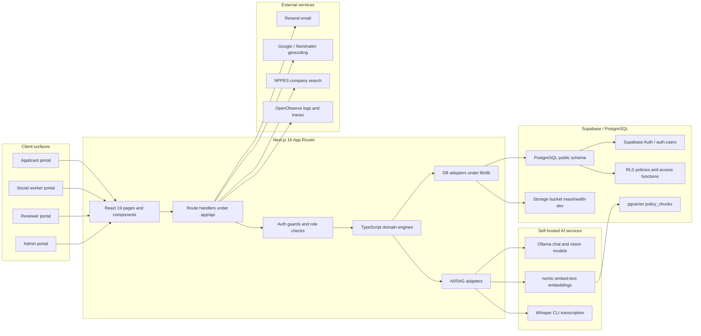

## 4. Architectural Style And Boundaries

### Selected Style

Use a feature-first modular monolith with strict internal boundaries:

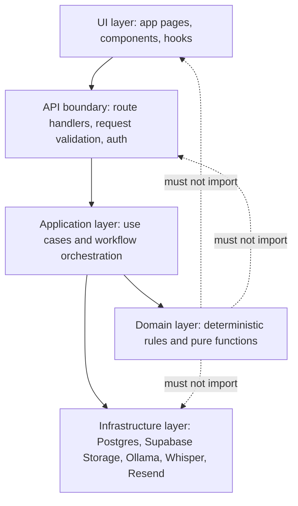

### Dependency Rules

| Rule | Rationale |
|---|---|
| UI cannot import DB modules directly | Keeps access control and persistence behavior centralized |
| Domain modules cannot import `next/*`, React, `pg`, or Supabase clients | Keeps rules deterministic and fast to unit test |
| Route handlers should validate and delegate, not own business logic | Reduces API handler size and makes workflow behavior reusable |
| LLM calls must sit behind adapters with strict output contracts | Prevents prompt and transport details from leaking into product logic |
| RAG should be task-specific | Controls latency, prompt size, and citation quality |

## 5. Runtime Request Flow

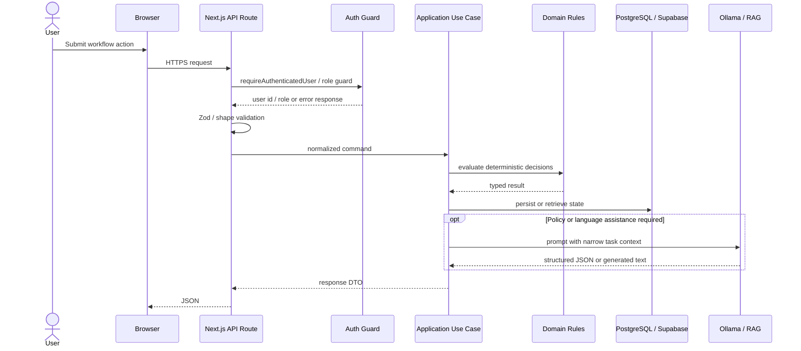

## 6. API Boundary Design

| API Area | Routes | Boundary Responsibility |
|---|---|---|
| Auth/dev auth | `app/api/auth/**` | Developer registration, invite claim, current-user lookup |
| Applications | `app/api/applications/**` | Draft CRUD, document metadata, generated PDF/document access |
| Benefit orchestration | `app/api/benefit-orchestration/**` | Profile persistence, deterministic stack evaluation, result history |
| Chat | `app/api/chat/masshealth/route.ts` | Mode selection, chat payload validation, RAG retrieval, prompt delegation |
| RAG | `app/api/rag/ingest/route.ts` | Staff/secret-protected policy ingestion into pgvector |
| Appeals | `app/api/appeals/**`, `app/api/masshealth/appeals/**` | Denial intake, policy retrieval, JSON-only appeal analysis/drafting |
| Income verification | `app/api/masshealth/income-verification/**`, `app/api/reviewer/income-verification/**` | Evidence checklist, document extraction, deterministic recompute, reviewer decisions |
| Identity | `app/api/identity/**` | DL barcode verification, mobile scan sessions, QR flow |
| Collaboration | `app/api/sessions/**` | Session lifecycle, participant messages, voice upload/transcription |
| Social worker messaging | `app/api/social-worker/**`, `app/api/patient/**`, `app/api/messages/**` | Engagement requests, direct messages, patient access |
| Admin | `app/api/admin/**` | Staff-only company, user, social worker, and stats administration |
| Notifications | `app/api/notifications/**` | Notification list, unread count, read state |
| Address/company lookup | `app/api/address/validate/**`, `app/api/companies/search/**` | Normalization against local/external sources |

## 7. Core Domain Data Flow

### Application Intake And Verification

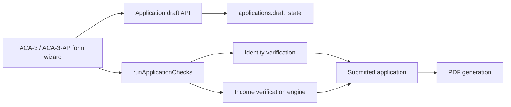

### Benefit Stack

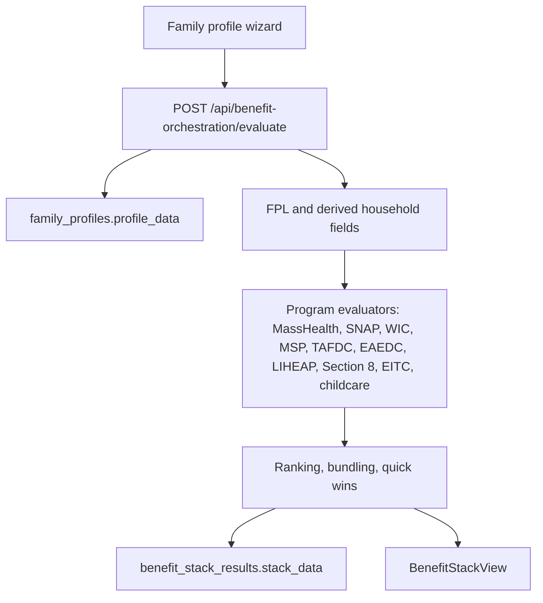

### MassHealth AI Assistant

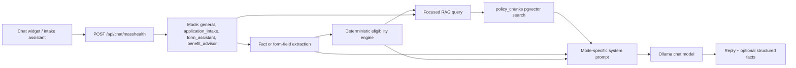

### Income Verification

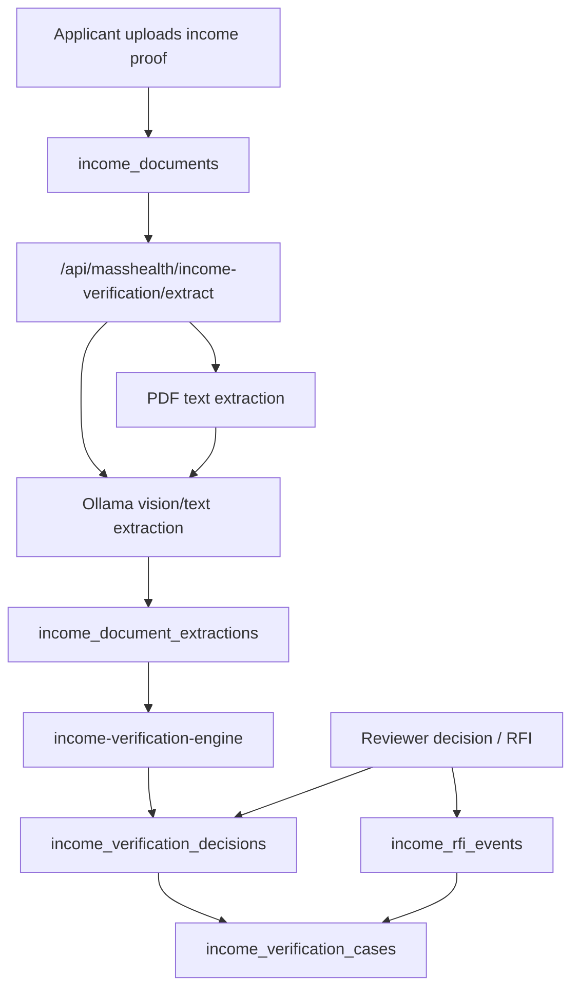

## 8. Database Design

The database is centered around users, applicants, applications, document evidence, workflow collaboration, and policy knowledge. Access is controlled by PostgreSQL RLS policies and helper functions such as `request_user_id()`, `is_staff()`, `can_access_applicant()`, `can_access_application()`, and `can_access_document()`.

```mermaid
erDiagram
  organizations ||--o{ users : owns
  users ||--o{ user_roles : has
  roles ||--o{ user_roles : grants
  users ||--o{ applicants : maps_to
  applicants ||--o{ applications : submits
  applications ||--o{ household_members : includes
  applications ||--o{ incomes : reports
  applications ||--o{ assets : reports
  applications ||--o{ documents : attaches
  documents ||--o{ document_pages : extracts
  documents ||--o{ document_extractions : produces
  applications ||--o{ validation_results : checks
  applications ||--o{ eligibility_screenings : screens
  applications ||--o{ review_actions : reviews
  applications ||--o{ rfis : requests
  users ||--o{ audit_logs : creates
  applications ||--o{ audit_logs : records

  applicants ||--|| user_profiles : extends
  applicants ||--|| family_profiles : owns
  family_profiles ||--o{ benefit_stack_results : generates

  applications ||--|| income_verification_cases : has
  applications ||--o{ income_evidence_requirements : requires
  applications ||--o{ income_documents : receives
  income_documents ||--|| income_document_extractions : extracts
  applications ||--o{ income_verification_decisions : decides
  applications ||--o{ income_rfi_events : requests

  users ||--o{ notifications : receives
  users ||--o{ identity_verification_attempts : performs
  applicants ||--o{ identity_verification_attempts : verifies
  users ||--o{ mobile_verify_sessions : starts

  companies ||--o{ social_worker_profiles : employs
  users ||--o{ social_worker_profiles : profile
  users ||--o{ patient_social_worker_access : patient_link
  users ||--o{ patient_social_worker_access : sw_link
  users ||--o{ collaborative_sessions : sw_participant
  users ||--o{ collaborative_sessions : patient_participant
  collaborative_sessions ||--o{ session_messages : contains
  users ||--o{ sw_engagement_requests : patient
  users ||--o{ sw_engagement_requests : social_worker
  users ||--o{ sw_direct_messages : sender

  policy_documents ||--o{ policy_chunks : chunks
```

### Key Tables

| Table | Purpose | Notes |
|---|---|---|
| `users`, `roles`, `user_roles` | App-level user and role model | Synced with Supabase Auth in migrations |
| `applicants` | Applicant identity and contact data | Includes identity status after later migrations |
| `applications` | Application lifecycle and draft data | Holds status, application type, draft state, income metadata |
| `household_members`, `incomes`, `assets` | Structured application facts | Inputs to eligibility/application checks |
| `documents`, `document_pages`, `document_extractions` | General document evidence and extraction results | Storage metadata extended by later document migrations |
| `income_*` tables | Dedicated income verification subsystem | Separates legal sufficiency from model extraction |
| `family_profiles`, `benefit_stack_results` | Benefit orchestration profile and result history | JSONB payloads with GIN indexes for flexibility |
| `policy_documents`, `policy_chunks` | RAG policy corpus | 768-dim pgvector embeddings using `nomic-embed-text` |
| `identity_verification_attempts`, `mobile_verify_sessions` | Identity scan and cross-device QR flow | Barcode scan result persistence and polling state |
| `companies`, `social_worker_profiles`, `patient_social_worker_access` | Social worker network model | Enables social-worker lookup and patient access |
| `collaborative_sessions`, `session_messages` | Scheduled/active collaborative sessions | Session messages include voice/text metadata |
| `sw_engagement_requests`, `sw_direct_messages` | Social worker direct messaging | Engagement request lifecycle and thread data |
| `notifications` | In-app and email notification state | Email dispatch uses Resend with non-fatal failure handling |
| `audit_logs` | Security and operational audit trail | Used for sensitive workflow traceability |

### Storage Design

Supabase Storage is accessed server-side through direct REST calls. The active bucket is `masshealth-dev`.

```text
{userId}/avatar/avatar.{ext}
{userId}/{applicationId}/{documentId}/{sanitizedFileName}
```

The server generates signed URLs with a short TTL for private downloads. Avatar upload uses overwrite semantics; application documents do not silently overwrite.

## 9. UI Architecture

```mermaid
flowchart TB
  Landing["/"]
  Auth["/auth/login, /auth/register, /auth/callback"]
  Applicant["Applicant portal"]
  SW["Social worker portal"]
  Reviewer["Reviewer portal"]
  Admin["Admin portal"]

  Applicant --> Dashboard["/customer/dashboard"]
  Applicant --> Prescreener["/prescreener"]
  Applicant --> Application["/application/type -> /application/new|renewal|household|check|confirmation"]
  Applicant --> Status["/customer/status"]
  Applicant --> Profile["/customer/profile"]
  Applicant --> BenefitStack["/benefit-stack"]
  Applicant --> Appeals["/appeal-assistant, /masshealth-appeals"]
  Applicant --> Knowledge["/knowledge-center"]

  SW --> SwDashboard["/social-worker/dashboard"]
  SW --> Patients["/social-worker/patients"]
  SW --> Sessions["/social-worker/sessions"]
  SW --> Messages["/social-worker/messages"]

  Reviewer --> Audit["/reviewer/audit"]
  Reviewer --> Cases["/reviewer/cases"]
  Reviewer --> ReviewerDashboard["/reviewer/dashboard"]

  Admin --> Companies["/admin/companies"]
  Admin --> SocialWorkers["/admin/social-workers"]
  Admin --> Users["/admin/users"]

  Landing --> Auth
  Auth --> Applicant
  Auth --> SW
  Auth --> Reviewer
  Auth --> Admin
```

### UI State Strategy

| State Type | Recommended Owner |
|---|---|
| Form field state during a single wizard step | Local component state or feature hook |
| Cross-step application draft state | Draft API plus persisted `applications.draft_state` |
| Current authenticated user and role | Supabase session plus route guard |
| Benefit profile and latest stack result | API-backed persisted state |
| In-app notifications | Redux slice plus notification API |
| Ephemeral chat input and transcript | Component state, optionally persisted only where product requires |
| Social-worker session state | Session APIs plus local session-room state |

## 10. AI / LLM System Design

### Prompt Design

Current prompts should remain mode-specific:

| Mode | Prompt Contract |
|---|---|
| General MassHealth assistant | Answer MassHealth-only questions; reject out-of-scope questions; use retrieved policy context when available |
| Application intake | Ask for missing facts one step at a time; preserve collected facts; avoid asking for already extracted relationships |
| Form assistant | Explain the current form section; extract form fields; return extracted field payloads separately from text |
| Benefit advisor | Use extracted facts and deterministic eligibility report; explain likely next actions in the requested language |
| Appeals | Return strict JSON with explanation, appeal letter, and evidence checklist |
| Income document extraction | Return strict extraction JSON only; do not decide legal sufficiency |

Rules:

- Deterministic thresholds, FPL math, and legal sufficiency decisions stay in TypeScript engines.
- LLMs perform extraction, explanation, summarization, drafting, and multilingual assistance.
- Any downstream-parsed output must have schema validation or defensive parsing.
- Prompt context should include only the active task, known facts, and the smallest useful retrieved policy block.

### Retrieval Strategy

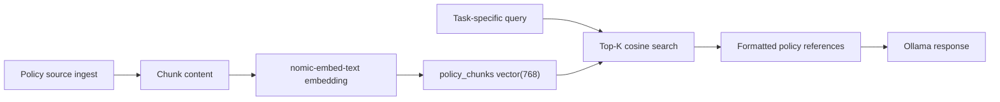

Retrieval should be constructed from:

- denial reason for appeals,
- top candidate program names for benefit advisor mode,
- current form section or latest form question for form assistant mode,
- last user question for general MassHealth QA.

Avoid using the full transcript as the retrieval query. Keep `topK` small unless evaluation shows a material retrieval gain.

### Evaluation Metrics

| Category | Metrics |
|---|---|
| Prompt reliability | JSON parse success rate, empty response rate, out-of-scope rejection accuracy, multilingual correctness |
| Retrieval | Golden-question hit rate, citation usefulness rate, duplicate chunk rate, average chunk score, empty-RAG fallback success |
| Deterministic agreement | Eligibility result agreement against fixtures, benefit recommendation precision, income verification decision agreement |
| Latency | P50/P95 by mode: general chat, form assistant, benefit advisor, appeal analysis, document extraction |
| Cost / capacity | Prompt token size, retrieved context length, embedding volume per ingest run, Ollama model load time |
| Safety | PII redaction in logs, malformed payload rejection rate, hallucinated threshold incidence in reviewed outputs |

## 11. Non-Functional Requirements

These targets should be treated as production objectives and tuned with measured telemetry.

| Capability | Target |
|---|---|
| App availability | 99.5% initial production target; revisit after traffic baseline |
| Page interaction latency | P95 under 2.5s for non-AI application workflows |
| Deterministic benefit evaluation | P95 under 200ms server-side |
| RAG retrieval | P95 under 1s after warm embedding model and DB pool |
| Chat/advisor response | P95 under 10s with self-hosted Ollama; stream later if UX requires |
| Appeal drafting | P95 under 15s; return graceful 502 on model failure |
| Income extraction | P95 under 30s for single image/PDF; async queue recommended when volume grows |
| Data protection | RLS on user-owned data; service role restricted to server-only paths |
| Recovery | Daily Supabase backups for production; define RPO/RTO with business owner before launch |
| Observability | Structured logs and traces for every API route; AI mode latency and parse outcome tags |

## 12. Security, Privacy, And Compliance Controls

| Area | Design |
|---|---|
| Authentication | Supabase Auth session, app-level `users` table, route-level auth guard |
| Authorization | RLS policies plus role helpers such as `is_staff()` and `can_access_*` |
| Service role | Server-only use for storage and privileged ingestion paths |
| PII | Redacted structured logging for sensitive keys such as authorization, token, password, SSN, and DOB |
| Storage | Private bucket paths partitioned by user/application/document; signed URLs for access |
| Audit | `audit_logs`, review actions, verification decisions, RFI records |
| AI data handling | Self-hosted Ollama reduces third-party model exposure; prompts should still minimize PII |
| Ingest protection | RAG ingestion requires authenticated user and optional `RAG_INGEST_SECRET` |
| Dev-only helpers | Developer auth routes must remain disabled or unreachable in production |

## 13. Deployment And Observability

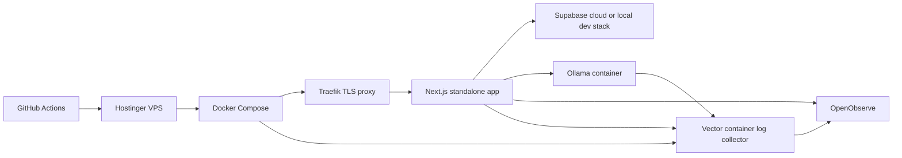

Current repo signals:

- `Dockerfile` builds a standalone Next.js image.
- `docker-compose.yml` runs Next.js, Traefik, Ollama, and optional analysis profile.
- `.github/workflows/deploy.yml` is documented as the SSH-based deployment path.
- `instrumentation.ts` loads OpenTelemetry only in the Node runtime when OpenObserve env vars exist.
- `lib/server/logger.ts` sends fire-and-forget structured logs to OpenObserve while preserving console logs.

## 14. Architecture Trade-Offs

| Decision | Selected | Alternative | Rationale |
|---|---|---|---|
| Application style | Modular monolith | Microservices | The product has many domains but not enough independent scaling pressure to justify distributed operational complexity |
| API style | REST-like App Router handlers | GraphQL | Current routes map cleanly to workflow commands; GraphQL would add schema and resolver overhead without obvious UI benefit |
| Persistence | Supabase/PostgreSQL | Custom backend plus separate object store | Supabase gives Auth, RLS, Storage, and PostgreSQL velocity; service-role and RLS discipline are the key risks |
| Vector store | pgvector in Postgres | Pinecone/Chroma | pgvector keeps policy RAG operationally simple; external vector DB can be introduced if corpus size or query latency requires |
| LLM runtime | Self-hosted Ollama | Hosted LLM API | Better PII control and local cost profile; trade-off is model quality, latency, and operational responsibility |
| Document extraction | Synchronous API today | Async worker queue | Synchronous is simpler for low volume; async jobs become necessary for high-volume extraction and retries |
| State management | Local state plus Redux for shared app concerns | Global store for all workflows | Keeps form and chat state near feature boundaries and reduces stale global state risk |

## 15. Target Refactor Path

The repo already has an architecture refactor plan. The practical path is incremental:

### Phase 1 - Boundary Stabilization

- Move route-specific orchestration from large route handlers into feature use cases.
- Preserve existing APIs and response shapes.
- Add contract tests around chat, appeals, benefit-stack evaluation, and income verification.
- Add telemetry tags for AI mode, retrieval topK, parse success, and fallback behavior.

### Phase 2 - Feature Modules

Proposed module layout:

```text
src/modules/
  application-intake/
  chat-assistant/
  benefit-stack/
  appeals/
  income-verification/
  identity-verification/
  collaboration/
  notifications/
  admin/
  shared/
```

Each module should expose:

- `domain/` for pure rules,
- `application/` for use cases,
- `infrastructure/` for repositories and service gateways,
- `ui/` for feature components,
- `api/` for route mappers.

### Phase 3 - Operational Hardening

- Add async job execution for document extraction, RAG ingestion, and bulk notifications.
- Add idempotency keys for long-running uploads and extraction jobs.
- Add dashboards for AI latency, parse failures, RAG hit rate, and verification bottlenecks.
- Formalize backup, restore, RPO, and RTO.

### Phase 4 - Service Extraction Only If Needed

Potential extraction candidates:

- document extraction worker,
- policy ingestion and embedding worker,
- notification dispatcher,
- analytics/reporting service.

Do not extract core eligibility or application intake prematurely; their data ownership is tightly coupled to the product workflow.

## 16. Validation Plan

| Layer | Tests / Checks |
|---|---|
| Domain rules | Unit tests for FPL, eligibility, income verification, application checks, identity scoring |
| API contracts | Route tests for auth, validation, happy path, malformed payload, and role restrictions |
| RAG | Golden retrieval fixtures, empty-store fallback, duplicate-chunk checks |
| Prompts | Parse success tests, malformed JSON handling, out-of-scope cases, multilingual snapshots |
| UI | Component tests for major panels, Storybook for shared UI, Playwright for critical workflows |
| Database | Migration replay, RLS policy smoke tests, index coverage for hot queries |
| Observability | Verify trace export, structured log delivery, PII redaction, and route error context |
| Deployment | Build, container boot, health check, rollback, database migration dry run |

## 17. Open Architecture Risks

| Risk | Impact | Mitigation |
|---|---|---|
| Oversized route and component files | Slower changes and higher regression risk | Move orchestration into feature use cases and split UI presenters |
| Synchronous AI extraction | Request timeouts under real volume | Introduce background job table/worker for extraction and ingestion |
| Self-hosted model latency | Poor chat and extraction UX during cold starts | Track P95 by mode, pre-warm model, stream responses, or selectively use hosted fallback |
| Policy retrieval quality | Incorrect or weakly grounded guidance | Golden retrieval set, citation usefulness scoring, topK/query tuning |
| JSON parsing fragility | Failed appeal/extraction workflows | Strict schemas, repair-free rejection, retry policy, parse success dashboard |
| RLS drift | Data exposure or broken access | Policy tests and migration review checklist for every new table |
| JSONB-heavy profile/result data | Harder analytics over time | Keep JSONB for workflow flexibility, promote stable reporting fields as product analytics mature |

