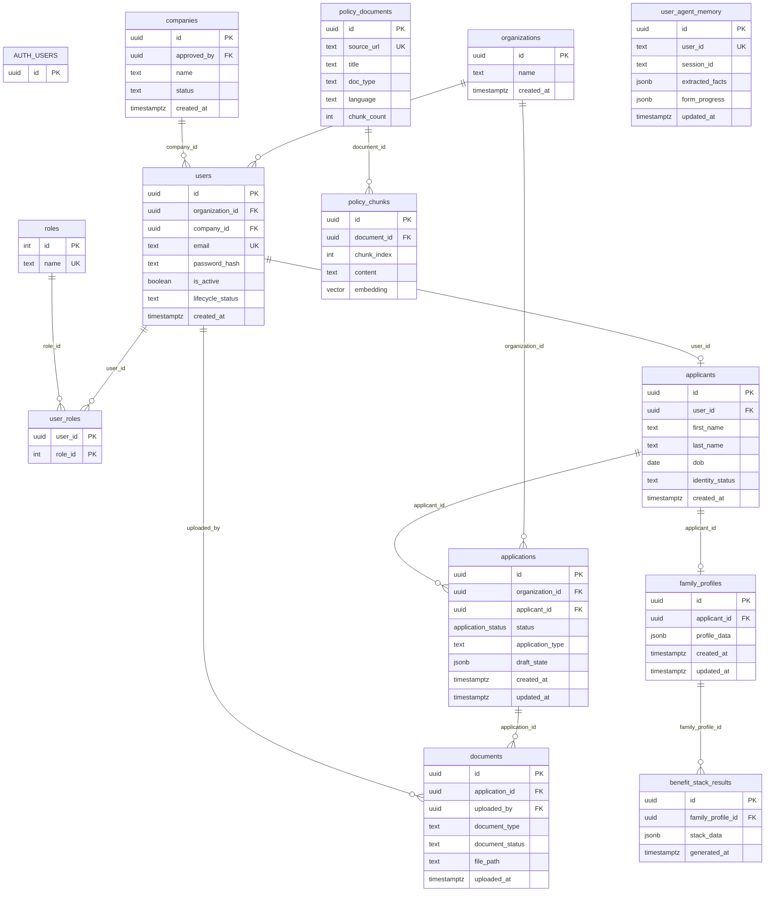
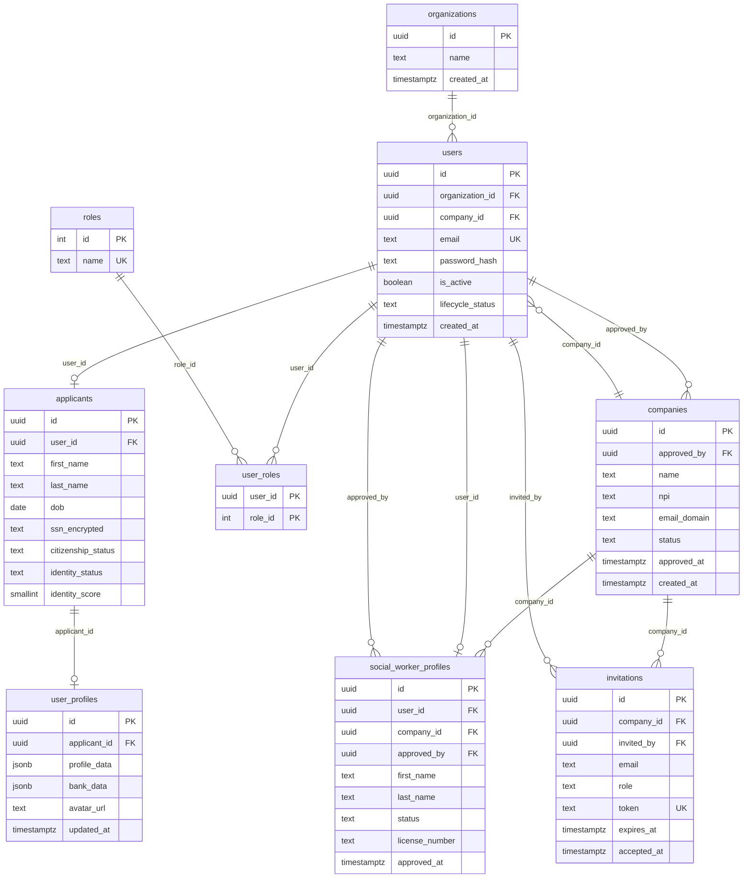
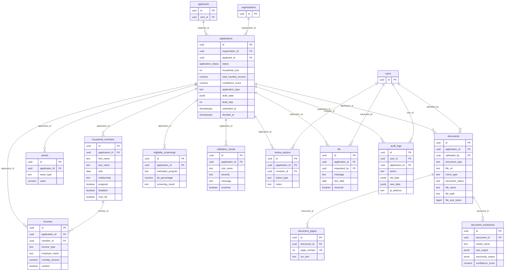
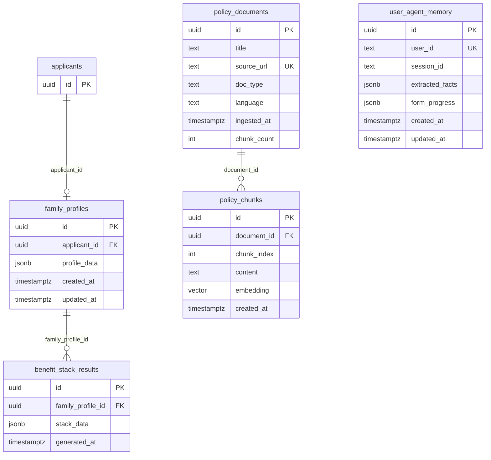
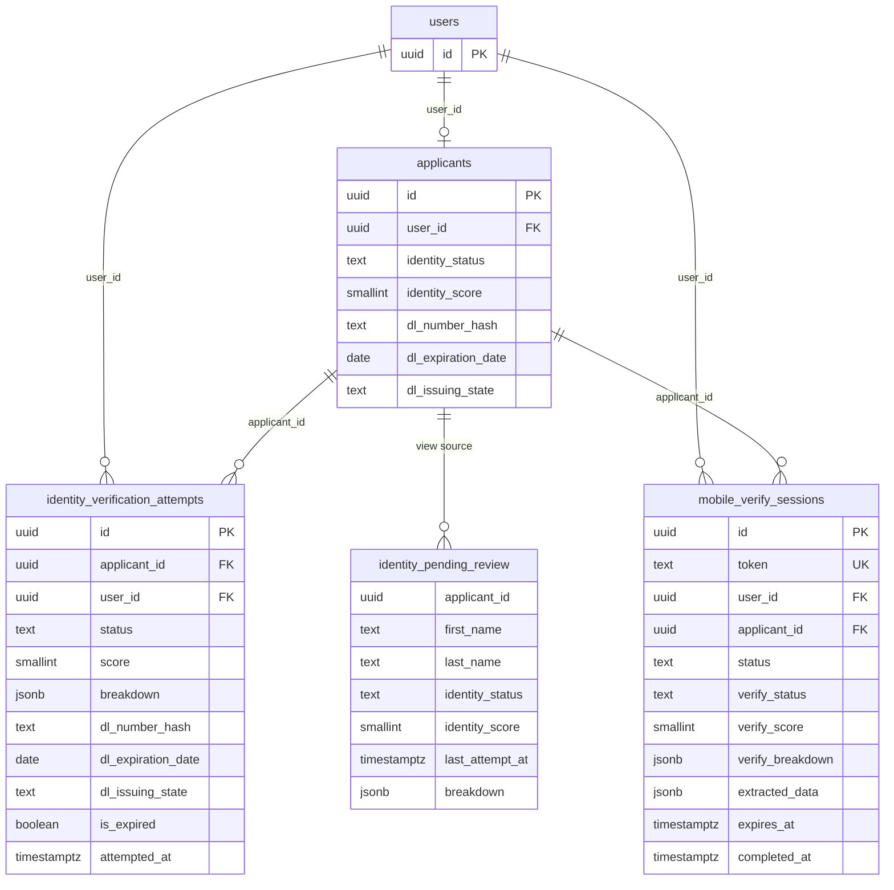
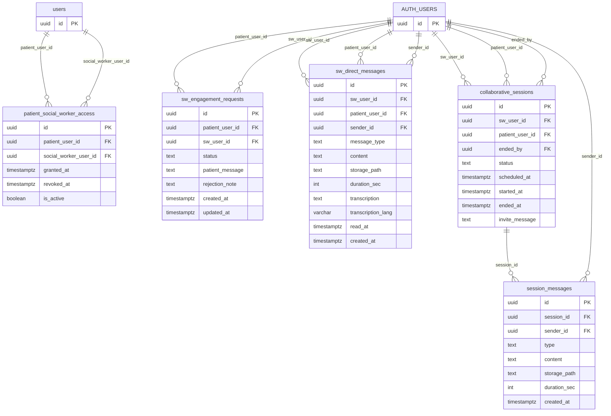
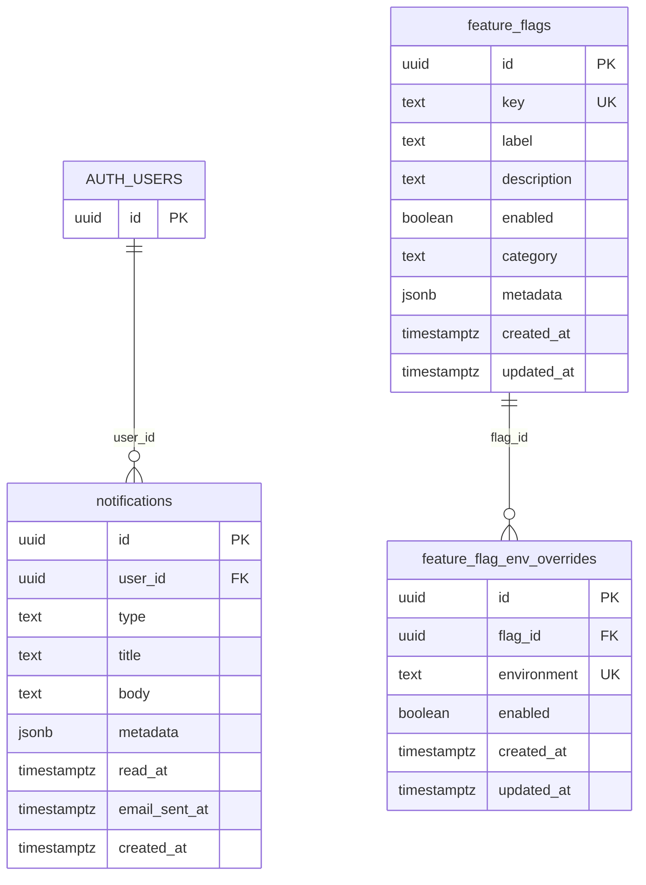

# Cloud Database Entity Relationship Diagram

**Source:** Cloud Supabase `public` schema  
**Database:** `postgres`  
**Inspected at:** 2026-04-15 22:22:35 UTC  
**Scope:** Schema metadata only. No row data was read.  

The cloud database currently exposes **36 public base tables** and **1 public view**. Several newer collaboration and notification tables reference Supabase `auth.users` directly, while the core application schema uses the app-owned `public.users` table. The diagrams below show that boundary explicitly.

## Table Inventory

| Domain | Tables |
|---|---|
| Identity and access | `organizations`, `companies`, `users`, `roles`, `user_roles`, `applicants`, `user_profiles`, `invitations`, `social_worker_profiles` |
| Application case management | `applications`, `household_members`, `incomes`, `assets`, `documents`, `document_pages`, `document_extractions`, `eligibility_screenings`, `validation_results`, `review_actions`, `rfis`, `audit_logs` |
| AI, RAG, and benefits | `policy_documents`, `policy_chunks`, `user_agent_memory`, `family_profiles`, `benefit_stack_results` |
| Identity verification | `identity_verification_attempts`, `mobile_verify_sessions`; view: `identity_pending_review` |
| Social-worker collaboration | `patient_social_worker_access`, `sw_engagement_requests`, `sw_direct_messages`, `collaborative_sessions`, `session_messages` |
| Platform support | `notifications`, `feature_flags`, `feature_flag_env_overrides` |

## System-Level ERD

## Identity and Access ERD

## Application Case Management ERD

## AI, RAG, and Benefit ERD

**Note:** `user_agent_memory.user_id` is `text` and unique, but the cloud schema does not define a foreign key to `public.users` or `auth.users`.

## Identity Verification ERD

## Social-Worker Collaboration ERD

## Platform Support ERD

## Foreign Key Relationship Catalog

| From table | Column | To table | Delete behavior |
|---|---|---|---|
| `applicants` | `user_id` | `users.id` | default |
| `applications` | `applicant_id` | `applicants.id` | default |
| `applications` | `organization_id` | `organizations.id` | default |
| `assets` | `application_id` | `applications.id` | cascade |
| `audit_logs` | `application_id` | `applications.id` | set null |
| `audit_logs` | `user_id` | `users.id` | default |
| `benefit_stack_results` | `family_profile_id` | `family_profiles.id` | cascade |
| `companies` | `approved_by` | `users.id` | default |
| `documents` | `application_id` | `applications.id` | cascade |
| `documents` | `uploaded_by` | `users.id` | default |
| `document_pages` | `document_id` | `documents.id` | cascade |
| `document_extractions` | `document_id` | `documents.id` | cascade |
| `eligibility_screenings` | `application_id` | `applications.id` | cascade |
| `family_profiles` | `applicant_id` | `applicants.id` | cascade |
| `feature_flag_env_overrides` | `flag_id` | `feature_flags.id` | cascade |
| `household_members` | `application_id` | `applications.id` | cascade |
| `identity_verification_attempts` | `applicant_id` | `applicants.id` | cascade |
| `identity_verification_attempts` | `user_id` | `users.id` | cascade |
| `incomes` | `application_id` | `applications.id` | cascade |
| `incomes` | `member_id` | `household_members.id` | default |
| `incomes` | `(member_id, application_id)` | `household_members(id, application_id)` | cascade |
| `invitations` | `company_id` | `companies.id` | set null |
| `invitations` | `invited_by` | `users.id` | set null |
| `mobile_verify_sessions` | `applicant_id` | `applicants.id` | cascade |
| `mobile_verify_sessions` | `user_id` | `users.id` | cascade |
| `patient_social_worker_access` | `patient_user_id` | `users.id` | cascade |
| `patient_social_worker_access` | `social_worker_user_id` | `users.id` | cascade |
| `policy_chunks` | `document_id` | `policy_documents.id` | cascade |
| `review_actions` | `application_id` | `applications.id` | default |
| `review_actions` | `reviewer_id` | `users.id` | default |
| `rfis` | `application_id` | `applications.id` | default |
| `rfis` | `requested_by` | `users.id` | default |
| `social_worker_profiles` | `approved_by` | `users.id` | default |
| `social_worker_profiles` | `company_id` | `companies.id` | default |
| `social_worker_profiles` | `user_id` | `users.id` | cascade |
| `user_profiles` | `applicant_id` | `applicants.id` | cascade |
| `user_roles` | `role_id` | `roles.id` | cascade |
| `user_roles` | `user_id` | `users.id` | cascade |
| `users` | `company_id` | `companies.id` | set null |
| `users` | `organization_id` | `organizations.id` | default |
| `validation_results` | `application_id` | `applications.id` | cascade |
| `collaborative_sessions` | `sw_user_id`, `patient_user_id`, `ended_by` | `auth.users.id` | cascade for participants; default for `ended_by` |
| `session_messages` | `session_id` | `collaborative_sessions.id` | cascade |
| `session_messages` | `sender_id` | `auth.users.id` | cascade |
| `notifications` | `user_id` | `auth.users.id` | cascade |
| `sw_direct_messages` | `sw_user_id`, `patient_user_id`, `sender_id` | `auth.users.id` | cascade |
| `sw_engagement_requests` | `patient_user_id`, `sw_user_id` | `auth.users.id` | cascade |

## Index and Constraint Highlights

- `policy_chunks.embedding` has an `ivfflat` vector cosine index for RAG retrieval.
- `applications.draft_state`, `benefit_stack_results.stack_data`, `document_extractions.structured_output`, and `user_profiles.profile_data` have GIN indexes.
- `applications` has trigram indexes over `application_type`, `id::text`, and applicant name extracted from `draft_state`.
- `document_pages` enforces unique `(document_id, page_number)`.
- `incomes` has both a simple `member_id` FK and a composite `(member_id, application_id)` FK to `household_members(id, application_id)`.
- `audit_logs` has two foreign key constraints on `application_id` pointing to `applications(id)` with `ON DELETE SET NULL`; this appears redundant in the cloud schema.
- `user_agent_memory.user_id` is unique and indexed but is not enforced as a FK.
- Collaboration tables are split across app-owned `public.users` references and Supabase-native `auth.users` references. This is workable, but it should be documented as an intentional boundary or normalized in a future migration.

## Public View

| View | Purpose inferred from schema |
|---|---|
| `identity_pending_review` | Joins applicant identity fields with latest verification attempt data for applicants needing manual identity review. |

## Diagram Maintenance

Regenerate this document after any migration that changes:

- table ownership or auth boundaries,
- FK constraints,
- RAG policy document/chunk schema,
- application draft/document/reviewer workflows,
- agent memory schema,
- identity verification tables,
- social-worker messaging/session tables.
