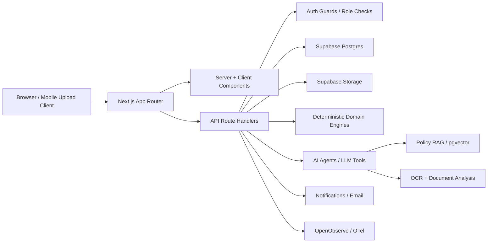
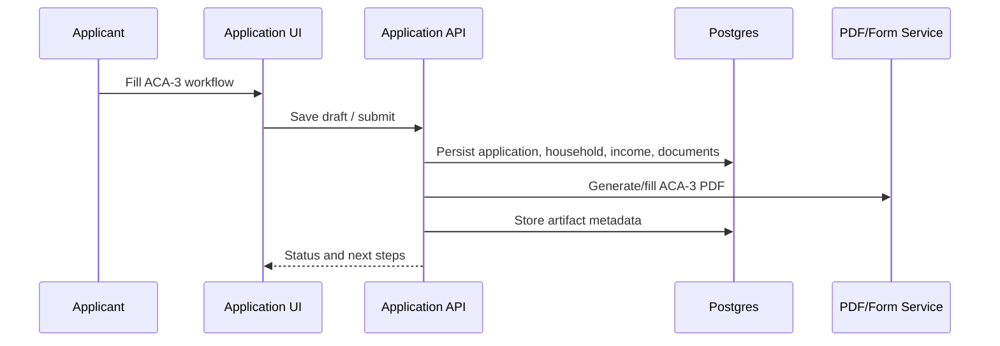
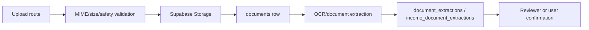
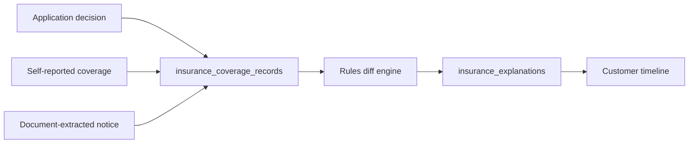

# System Architecture and Data

**Status:** Canonical architecture and data documentation  
**Last updated:** 2026-06-06

## Architecture Overview

HealthCompass MA is a Next.js App Router application backed by Supabase/Postgres, Supabase Storage, pgvector, and AI/provider integrations. The system is intentionally structured as a modular monolith: route handlers define API boundaries, `lib/db/*` owns persistence, deterministic domain engines own eligibility and benefit rules, and AI agents are isolated behind explicit route/tool boundaries.



## Runtime Boundaries

| Boundary | Responsibility | Implementation pattern |
|---|---|---|
| UI routes | Render workflows and authenticated surfaces. | Next.js App Router under `app/`; keep data fetching in server components where possible. |
| API routes | Validate requests, enforce auth, call DB/domain/agent layers. | `app/api/**/route.ts`; use Zod or explicit guards for inputs. |
| DB access | Encapsulate Postgres queries and table-specific behavior. | `lib/db/*`, `lib/supabase/*`, `pg` server client. |
| Domain logic | Deterministic eligibility, benefit, extraction, and validation logic. | Pure TypeScript modules with focused unit tests. |
| AI tools | LLM prompts, tool schemas, RAG retrieval, explanation/drafting. | `lib/agents/*`, `lib/masshealth/*`, AI SDK routes. |
| Storage | User documents, thumbnails, PDFs, encrypted PHI draft blobs. | Supabase Storage paths; route-mediated access. |
| Observability | Logs, traces, health checks, and deployment diagnostics. | `lib/server/logger.ts`, OTel hooks, OpenObserve deployment files. |

## API Families

| Family | Routes | Notes |
|---|---|---|
| Auth and account | `/api/auth/*`, `/api/user-profile/*`, `/api/user/passkey/*` | Account state, MFA/passkey, profile, SSN handling. |
| Applications | `/api/applications/*`, `/api/forms/aca-3-0325/fill` | Drafts, documents, PHI draft save/resume, PDF fill. |
| Documents and uploads | `/api/documents/*`, `/api/upload/mobile/[token]`, `/api/pdf/*` | Upload validation, mobile token upload, parse/generate PDF. |
| Identity | `/api/identity/*` | Driver-license verification, mobile verification sessions, QR code. |
| Agents and chat | `/api/agents/*`, `/api/chat/masshealth`, `/api/rag/ingest` | Agent orchestration, MassHealth chat, vision, intake, benefit advisor. |
| Benefits and appeals | `/api/benefit-orchestration/*`, `/api/masshealth/*`, `/api/appeals/*` | Benefit stack, income verification, policy updates, appeals. |
| Insurance history | `/api/insurance-history/*` | Coverage records and explanation generation. |
| Collaboration | `/api/sessions/*`, `/api/social-worker/*`, `/api/messages/*` | Social-worker engagement, sessions, direct messages, voice. |
| Admin and reporting | `/api/admin/*`, `/api/companies/search` | Users, roles, glossary, reports, analytics, exports. |
| Notifications and growth | `/api/notifications/*`, `/api/growth/*` | Notification lifecycle, referral/mailing-list capture. |
| Health | `/api/health/*` | App/database health probes. |

## Data Architecture

The database is Supabase/Postgres with RLS, pgvector, domain tables, audit tables, and generated schema artifacts. The latest generated live schema artifacts are:

- `supabase/er-diagram.md`
- `docs/database/CLOUD_DATABASE_ERD.md`
- `docs/database-schema.drawio`
- `docs/database/052802026.drawio`

Regenerate with:

```bash
pnpm run db:schema:generate
```

The current live schema generation reported:

| Metric | Value |
|---|---:|
| Public base tables | 59 |
| Foreign-key columns | 76 |
| Relationships | 74 |

## Data Domains

| Domain | Representative tables |
|---|---|
| Identity and access | `users`, `roles`, `user_roles`, `role_permissions`, `admin_passkey_credentials`, `user_passkey_credentials`, `revoked_sessions`, `login_events`. |
| Organizations and workforce | `organizations`, `companies`, `invitations`, `social_worker_profiles`, `patient_social_worker_access`. |
| Applicants and applications | `applicants`, `applications`, `household_members`, `incomes`, `assets`, `validation_results`, `eligibility_screenings`. |
| Documents and extraction | `documents`, `document_pages`, `document_extractions`, `income_documents`, `income_document_extractions`. |
| Income verification | `income_verification_cases`, `income_evidence_requirements`, `income_verification_decisions`, `income_rfi_events`. |
| Benefits and profile | `user_profiles`, `family_profiles`, `benefit_stack_results`, `insurance_coverage_records`, `insurance_explanations`. |
| AI and policy | `policy_documents`, `policy_chunks`, `user_agent_memory`, `mh_appeal_source_documents`, `mh_appeal_source_chunks`, `mh_denial_patterns`. |
| Collaboration and notifications | `collaborative_sessions`, `session_messages`, `sw_engagement_requests`, `sw_direct_messages`, `notifications`. |
| Platform support | `feature_flags`, `feature_flag_env_overrides`, `glossary_terms`, `rate_limit_counters`, `mailing_list_signups`, `growth_referrals`. |

## Data Flow Patterns

### Application Intake



### Document Upload and Extraction



### Insurance History



## Migration and Schema Rules

- Every schema change belongs in `supabase/migrations/`.
- Use `supabase db reset` locally when validating the complete migration chain.
- Use `pnpm run db:migrate:dev` for local migration application where reset is not appropriate.
- After changing schema, regenerate schema artifacts and update this file if domains, ownership, or API contracts changed.
- Do not encode business behavior solely in undocumented triggers/functions; document it here and in requirements if it affects users.

## Deployment Architecture

| Component | Role |
|---|---|
| Next.js app | Primary web app and API runtime. |
| Supabase | Database, auth, storage, pgvector, RLS. |
| Resend | Transactional email for invitations and notifications. |
| Groq / Ollama | LLM primary and local fallback, depending on environment. |
| MassHealth analysis service | External/local Python analysis service for document/policy analysis where configured. |
| OpenObserve + Vector | Log/trace collection and VPS/container observability. |
| Whisper | Voice transcription path for messaging. |

## Architecture Tradeoffs

| Decision | Benefit | Cost / risk |
|---|---|---|
| Modular monolith | Fast iteration, shared types, simpler deployment. | Requires disciplined module boundaries. |
| Supabase/Postgres primary data platform | RLS, auth integration, pgvector, storage. | Vendor coupling and RLS complexity. |
| Deterministic eligibility engines | Testable and auditable benefit logic. | Requires active policy maintenance. |
| LLM as assistant/explainer, not authority | Safer compliance posture. | More work to design fallbacks and citations. |
| Generated schema artifacts | Keeps docs aligned with live DB. | Requires live DB access or local Supabase to regenerate. |

