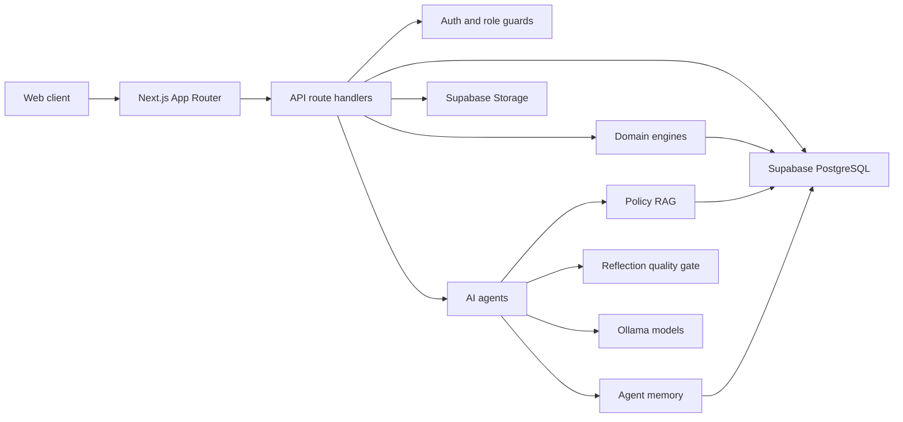

# HealthCompass MA Requirements Package

**Status:** Generated from current codebase  
**Baseline date:** 2026-04-15  
**Primary source paths:** `app/`, `components/`, `lib/`, `database/`, `docs/AI_AGENT_DESIGN.md`, `docs/AI_AGENT_ARCHITECTURE_OVERVIEW.md`  

This package describes what the application must do today and how the next development phases should evolve. It is intentionally written as implementation-facing requirements, not marketing material.

## Documents

| Document | Purpose |
|---|---|
| [Product Requirements](./PRODUCT_REQUIREMENTS.md) | Users, goals, feature scope, release outcomes, acceptance criteria. |
| [Functional Requirements](./FUNCTIONAL_REQUIREMENTS.md) | Numbered requirements for product workflows and user-facing behavior. |
| [AI Agent Requirements](./AI_AGENT_REQUIREMENTS.md) | Prompt, RAG, tool, memory, reflection, and evaluation requirements for all agents. |
| [API and Integration Requirements](./API_INTEGRATION_REQUIREMENTS.md) | Route families, contracts, integration boundaries, error handling, and compatibility rules. |
| [Data and Security Requirements](./DATA_SECURITY_REQUIREMENTS.md) | Data ownership, Supabase tables, PII/PHI handling, auth, audit, retention, and privacy requirements. |
| [Non-Functional Requirements](./NON_FUNCTIONAL_REQUIREMENTS.md) | Performance, reliability, observability, scalability, accessibility, testing, and operations targets. |
| [Future Development Plan](./FUTURE_DEVELOPMENT_PLAN.md) | Phased roadmap, migration strategy, production hardening, and backlog. |
| [Traceability Matrix](./TRACEABILITY_MATRIX.md) | Mapping from feature areas to current implementation files, tests, and future requirements. |

## Requirement ID Conventions

| Prefix | Domain |
|---|---|
| `PRD` | Product requirement |
| `FR` | Functional requirement |
| `AI` | Agent and LLM requirement |
| `API` | API and integration requirement |
| `DATA` | Data, privacy, and security requirement |
| `NFR` | Non-functional requirement |
| `PLAN` | Future development plan item |

## Current System Summary

HealthCompass MA is a Next.js 16, React 19, TypeScript application backed by Supabase/PostgreSQL. The app supports MassHealth application intake, eligibility prescreening, AI-assisted form completion, benefit orchestration, appeal drafting, identity verification, document extraction, collaborative social-worker sessions, notifications, admin management, and reviewer workflows.

The AI architecture is a modular agent set built with AI SDK streaming tools and Ollama models. Deterministic TypeScript engines own eligibility and benefit decisions. LLMs handle extraction, drafting, explanation, translation, policy-grounded conversation, and reflection. Policy grounding uses pgvector RAG with chunk score, source tier, and citation coverage metadata.

## Architecture Context

## Maintenance Rules

- Update the affected requirement document in the same pull request as a user-facing feature, agent behavior change, data model change, or API contract change.
- Keep deterministic eligibility and benefit logic documented separately from LLM explanation behavior.
- When changing an agent, update prompt design, retrieval strategy, evaluation metrics, and fallback behavior in [AI Agent Requirements](./AI_AGENT_REQUIREMENTS.md).
- When adding a route or table, update [API and Integration Requirements](./API_INTEGRATION_REQUIREMENTS.md), [Data and Security Requirements](./DATA_SECURITY_REQUIREMENTS.md), and [Traceability Matrix](./TRACEABILITY_MATRIX.md).
- Requirement IDs should remain stable. If a requirement is replaced, mark it superseded instead of reusing the ID for unrelated behavior.
