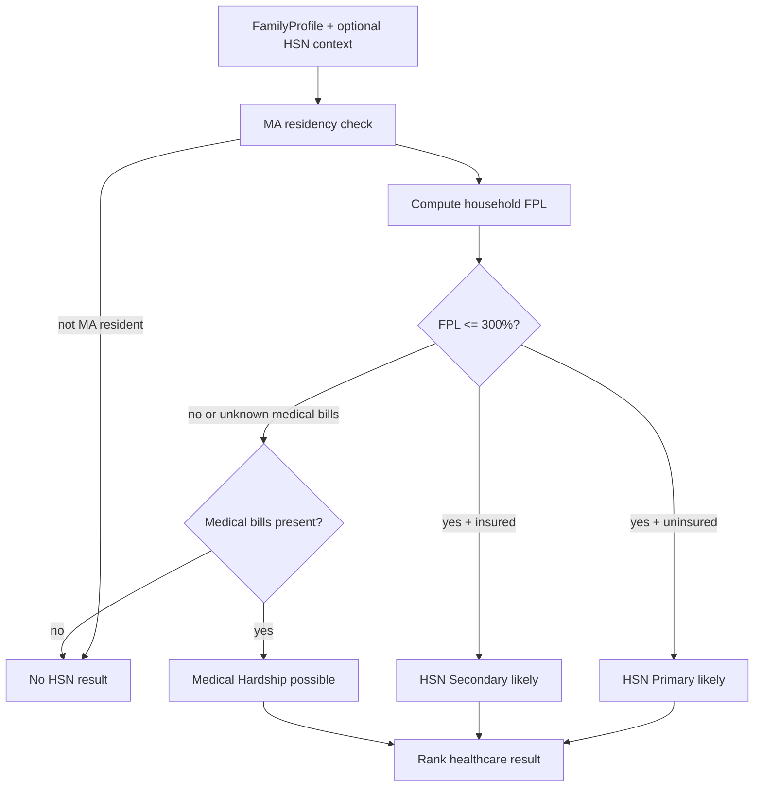

# Health Safety Net Eligibility Feature - Design Spec

**Date:** 2026-06-02  
**Status:** Draft - ready for first implementation slice  
**Primary surface:** Benefit Stack + Benefit Advisor  
**Policy source:** [101 CMR 613.00: Health Safety Net Eligible Services](https://www.mass.gov/regulations/101-CMR-61300-health-safety-net-eligible-services)

---

## Overview

Add Health Safety Net (HSN) support as a distinct healthcare benefit in the platform. HSN should not be modeled as another MassHealth coverage track. It is a payer-of-last-resort program for eligible services delivered by acute hospitals and community health centers, with separate Low Income Patient, Medical Hardship, presumptive determination, deductible, copayment, and provider-location rules.

The first version should screen and route users, not promise final eligibility. Official Low Income Patient determinations still flow through the MassHealth / Health Connector eligibility process, and Medical Hardship requires provider-assisted documentation and Health Safety Net Office approval.

---

## Policy Facts To Encode

Source-backed baseline from 101 CMR 613.00:

- Eligible service categories are Low Income Patient reimbursable services, Medical Hardship, and Bad Debt.
- HSN is payer of last resort. It does not pay where another public or private payer is responsible.
- Low Income Patient status requires Massachusetts residency and income at or below 300% FPL, with Health Safety Net - Primary for uninsured patients and Health Safety Net - Secondary for patients with other primary insurance.
- People determined eligible for MassHealth or premium assistance but who fail to enroll, or whose coverage was terminated for unpaid premiums, are not eligible for Low Income Patient status.
- Health Safety Net - Partial applies above 150% and at or below 300% FPL, with a deductible if all members of the Premium Billing Family Group are above 150% FPL.
- Low Income Patient status is effective for up to one year, subject to redetermination.
- Presumptive Low Income Patient status is time-limited and starts on provider determination.
- Medical Hardship can apply at any income level when allowable medical expenses exceed the required percentage of countable income. It is a one-time determination, not ongoing eligibility.
- Medical Hardship applications are limited to no more than two in a 12-month period.
- Allowable Medical Hardship expenses may include paid and unpaid bills from the prior 12 months, with special handling for delayed initial bills.
- HSN pays only listed reimbursable services from acute hospitals and community health centers.

Administrative update to track:

- Administrative Bulletin 25-24 temporarily suspends dental prior authorization requirements for HSN dental services for dates of service on or after October 1, 2025, effective October 17, 2025. Treat this as source-backed retrieval content, not a hard-coded permanent rule.

---

## User Flow

### Benefit Stack Screening

Add HSN to `/benefit-stack` as a healthcare program card with three possible result paths:

1. **Likely HSN Primary**
   - MA resident.
   - Uninsured.
   - Household income at or below 300% FPL.
   - Not blocked by known MassHealth / premium-assistance non-enrollment facts.

2. **Likely HSN Secondary**
   - MA resident.
   - Has private, Medicare, student, or other primary coverage.
   - Household income at or below 300% FPL.
   - Explain that HSN may help only with reimbursable services not covered by primary insurance and applicable cost sharing, subject to program-specific exceptions.

3. **Possible Medical Hardship**
   - MA resident.
   - Any income level.
   - User reports significant recent medical bills or expected inability to pay.
   - If medical-bill facts are missing, show as `possibly` with a next step to collect bills and ask the provider's financial counseling office.

Do not return HSN when `stateResident=false`. For income above 300% FPL and no medical-expense facts, omit HSN from the stack rather than showing an ineligible card.

### Benefit Advisor / Chat

Add Health Safety Net as a supported topic in the Benefit Advisor agent:

- If the user asks "can HSN help me?", call deterministic screening first.
- If facts are incomplete, ask one missing question at a time:
  - MA resident?
  - uninsured or insured?
  - household size and monthly income?
  - any recent unpaid or paid medical bills?
  - provider type, if the question is about a specific bill or service?
- Use RAG for service coverage, dental prior authorization bulletins, Medical Hardship documentation, grievance timing, and payer-of-last-resort explanations.
- Never let the model independently calculate final HSN eligibility or service reimbursement.

---

## API Boundary

### Existing API

Reuse `POST /api/benefit-orchestration/evaluate` for Benefit Stack. The route already saves the profile, runs the pure rule engine, persists the result, and returns the stack.

### New Pure Evaluator

Add:

```text
lib/benefit-orchestration/programs/health-safety-net.ts
```

Export:

```ts
export function evaluateHealthSafetyNet(
  profile: FamilyProfile,
  fplPercent: number,
): BenefitResult[]
```

Register the evaluator in:

```text
lib/benefit-orchestration/orchestrator.ts
```

Add program IDs:

```ts
| "health_safety_net_primary"
| "health_safety_net_secondary"
| "health_safety_net_medical_hardship"
```

### Optional Future API

For phase 2 bill-specific workflows, add:

```text
POST /api/health-safety-net/screen
```

Input should include `FamilyProfile` plus `HealthSafetyNetContext`, so bill screening does not pollute the generic family profile:

```ts
interface HealthSafetyNetContext {
  hasRecentMedicalBills?: boolean
  totalAllowableMedicalBillsLast12Months?: number
  hasUnpaidMedicalBills?: boolean
  providerType?: "acute_hospital" | "community_health_center" | "other" | "unknown"
  serviceDate?: string
  serviceCategory?: string
  hasOtherResponsiblePayer?: boolean
  massHealthEligibleButNotEnrolled?: boolean
  premiumAssistanceTerminatedForNonpayment?: boolean
  healthConnectorPremiumAssistanceEligible?: boolean
  studentHealthProgramRequired?: boolean
  previousMedicalHardshipApplicationsLast12Months?: number
}
```

---

## Deterministic Logic Boundary

The rule engine should deterministically decide only the parts supported by collected facts:



Deterministic checks:

- `stateResident`.
- `hasPrivateInsurance`, `hasEmployerInsurance`, `hasMedicare`.
- FPL percent via existing `getIncomeAsFPLPercent` / `computeMAGIMonthly` helpers.
- HSN Primary vs Secondary branch.
- Partial deductible warning for `150% < FPL <= 300%`.
- Known blocker flags if collected.
- Medical Hardship "possible" when expenses are present but exact threshold and allowable-expense verification are not complete.

Do not encode:

- Full service-code reimbursement determinations.
- Claims payment decisions.
- Provider compliance or bad debt workflows.
- Dental prior authorization status as a permanent rule.
- Final Medical Hardship approval.

---

## Data Model

### Phase 1

No database migration required if the first implementation only adds result cards to the existing persisted `BenefitStack` JSON.

### Phase 2

Add an optional HSN screening table if bill-specific routing is introduced:

```sql
CREATE TABLE health_safety_net_screenings (
  id uuid PRIMARY KEY DEFAULT gen_random_uuid(),
  user_id uuid NOT NULL REFERENCES auth.users(id),
  family_profile_id uuid REFERENCES family_profiles(id),
  provider_type text,
  service_date date,
  service_category text,
  total_medical_bills_last_12_months numeric,
  has_unpaid_medical_bills boolean,
  has_other_responsible_payer boolean,
  screening_result jsonb NOT NULL,
  created_at timestamptz DEFAULT now()
);
```

RLS should mirror `family_profiles`: applicant owns their rows; social worker access requires an approved relationship.

---

## Prompt Design

Prompt changes belong in `lib/agents/benefit-advisor/prompts.ts` and related tests.

Design:

- Add HSN to the agent's allowed MA health-benefit domain.
- Require deterministic `check_eligibility` before any eligibility explanation.
- Instruct the model to distinguish:
  - health insurance coverage,
  - HSN payer-of-last-resort assistance,
  - Medical Hardship,
  - provider financial counseling / charity-care workflows.
- For incomplete HSN facts, ask exactly one missing question and stop.
- For service-specific claims, retrieve policy first and qualify the answer with provider/service/date limitations.

Output constraints:

- Use plain language.
- Include source-aware caveats.
- Avoid "you qualify" for Medical Hardship; use "you may have a Medical Hardship path."
- Do not claim HSN covers providers outside acute hospitals and community health centers.

---

## Retrieval Strategy

Seed or ingest official HSN documents into policy RAG:

- 101 CMR 613.00 Health Safety Net Eligible Services, effective April 1, 2024.
- 101 CMR 614.00 Health Safety Net Payments and Funding for payment-rate context when needed.
- Administrative Bulletin 25-24 for temporary dental prior authorization suspension.
- Prior HSN administrative bulletins only when service-date-specific questions require them.

Chunking:

- Chunk by regulation section: `613.01`, `613.02`, `613.03`, `613.04`, `613.05`, etc.
- Keep section number, effective date, and source URL in metadata.
- Store administrative bulletins with effective date and expiration or "temporary" marker when available.

Retrieval queries:

- Eligibility: `"101 CMR 613.04 Low Income Patient Health Safety Net Primary Secondary 300 FPL"`.
- Medical hardship: `"101 CMR 613.05 Medical Hardship allowable medical expenses countable income"`.
- Services: `"101 CMR 613.03 reimbursable health services acute hospitals community health centers [service]"`.
- Dental PA: `"Administrative Bulletin 25-24 HSN dental prior authorization suspension"`.

Reliability:

- Prefer official `mass.gov` sources.
- If only non-official mirrors are retrieved, label the answer as needing official-source verification.
- If retrieval returns low confidence, fall back to deterministic screening and recommend calling HSN / provider financial counseling rather than filling in policy details.

---

## UI Changes

### Benefit Stack

Add HSN result cards using the existing `BenefitProgramCard` component:

- Category: `healthcare`.
- Administered by: `MA Health Safety Net`.
- Estimated value: `0` or conservative placeholder; do not fold into monthly cash-value totals unless a validated model exists.
- Value note: "May reduce eligible bills at acute hospitals and community health centers; exact value depends on service, provider, payer, and deductible."
- Application methods: `online`, `phone`, `in_person`.
- Application URL: `/application/new` for Low Income Patient route; no local app route for Medical Hardship until phase 2.
- Application note: "Ask the hospital or community health center financial counseling office about HSN and Medical Hardship."

### Intake

Phase 1 can use current fields. Phase 2 should add an optional HSN-specific panel:

- Recent medical bills in the last 12 months.
- Unpaid bill amount.
- Provider type.
- Insurance denial / other payer status.
- Student health plan or employer coverage availability.
- Prior Medical Hardship applications in last 12 months.

---

## Tests

Unit tests:

- `health-safety-net.test.ts`
  - non-resident returns no result.
  - uninsured MA resident at 0-150% FPL returns HSN Primary likely with no partial deductible warning.
  - uninsured MA resident above 150% and at or below 300% FPL returns HSN Primary likely with partial deductible requirement.
  - insured MA resident at or below 300% FPL returns HSN Secondary likely.
  - above 300% FPL with no bill facts returns no result.
  - above 300% FPL with recent medical bills returns Medical Hardship possible.
  - known MassHealth-eligible-but-not-enrolled flag suppresses Low Income Patient result.

Orchestrator tests:

- HSN is included in ranked healthcare results.
- HSN is excluded from estimated monthly cash total when estimated value is `0`.
- HSN appears with MassHealth/Connector results without duplicating program IDs.

Agent tests:

- HSN prompt asks one missing question for incomplete facts.
- HSN prompt refuses final service-coverage determinations without retrieval.
- Medical Hardship response uses "may be eligible" language and lists documentation next steps.

RAG tests/evals:

- Retrieval for Low Income Patient returns `613.04` chunks.
- Retrieval for Medical Hardship returns `613.05` chunks.
- Retrieval for service coverage returns `613.03` chunks.
- Dental prior authorization query retrieves Administrative Bulletin 25-24 when available.

---

## Evaluation Metrics

Rule-engine metrics:

- Branch accuracy on fixture cases: target 100%.
- False-positive rate for non-residents and above-300%-FPL/no-bill users: target 0%.
- HSN Primary vs Secondary classification accuracy: target 100% from known insurance flags.

RAG metrics:

- Top-3 retrieval hit rate for `613.03`, `613.04`, `613.05`: target >= 90%.
- Official-source coverage: target >= 95% for HSN answers.
- Low-confidence fallback correctness: target 100% of responses avoid unsupported service-coverage claims.

UX metrics:

- Benefit Stack completion impact after adding optional HSN fields: no more than 5% drop-off.
- HSN card CTA click-through to application/provider guidance.
- Chat deflection: percentage of HSN questions answered without live support escalation, segmented by retrieval confidence.

Latency and cost:

- Benefit Stack evaluator remains synchronous and sub-50ms.
- No LLM call in deterministic screening.
- RAG adds one vector query per HSN chat answer; cap at top 5 chunks.
- LLM only explains tool results; it does not decide eligibility.

---

## Rollout Plan

1. Implement `evaluateHealthSafetyNet` using existing profile fields only.
2. Register HSN program IDs and orchestrator integration.
3. Add tests for deterministic screening and stack ranking.
4. Add glossary seed entry for "Health Safety Net" if not already present.
5. Add RAG ingestion metadata for official HSN regulation and current administrative bulletin.
6. Update Benefit Advisor prompt and tests.
7. Add optional bill/provider questions in a second UI iteration once the core result is stable.

---

## Open Questions

- Should HSN be bundled with the MassHealth application bundle, or shown as a separate "MassHealth application / provider financial counseling" action? Initial recommendation: separate action, because Medical Hardship and provider-assisted workflows differ from standard MassHealth application completion.
- Do we want to store HSN screening context in the persisted `FamilyProfile`, or keep bill-specific context in a separate table? Initial recommendation: separate table in phase 2 to avoid bloating cross-program profile semantics.
- Should estimated monthly value be omitted instead of `0`? Current `BenefitResult` requires numeric value. Initial recommendation: set `0` and explicit `valueNote`, then consider an `estimatedValueType` field later.
